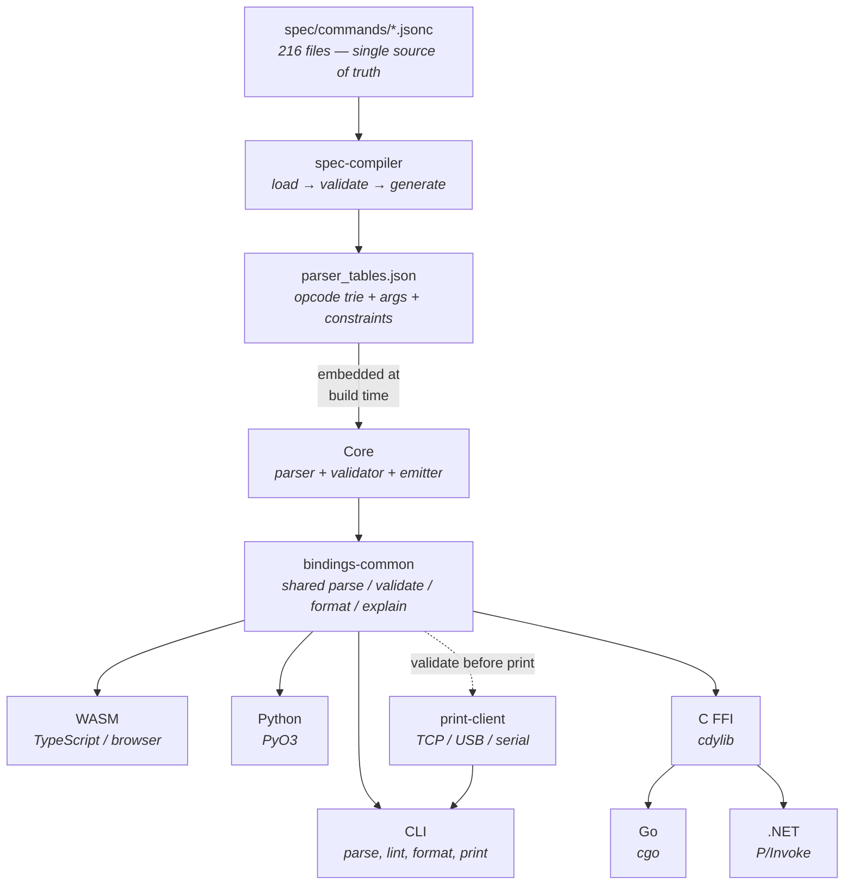

# zpl-toolchain


[](https://github.com/trevordcampbell/zpl-toolchain/actions/workflows/ci.yml)
[](https://crates.io/crates/zpl_toolchain_cli)
[](https://www.npmjs.com/package/@zpl-toolchain/core)
[](https://pypi.org/project/zpl-toolchain/)
[](#license)

A spec-first ZPL II toolchain for parsing, validating, formatting, and printing Zebra label files. Built in Rust with a CLI and bindings for TypeScript, Python, Go, and .NET.

---

## Why zpl-toolchain?

ZPL II is the standard language for Zebra thermal label printers, used across logistics, healthcare, retail, and manufacturing. Despite its ubiquity, there are no comprehensive open-source tools for working with it programmatically.

**zpl-toolchain** fills that gap: a complete, spec-driven toolkit that understands every ZPL II command, catches errors before they waste labels, auto-formats messy code, and sends labels directly to printers — all from one unified toolchain.

---

## Features

### Parsing & Analysis

- **Full ZPL II command coverage** — 223/223 commands (100%) across 216 per-command spec files, each audited against the official Zebra Programming Guide
- **Hand-written parser** — opcode trie for longest-match, signature-driven argument parsing, prefix/delimiter state tracking, UTF-8 safe, lossless round-trip capable
- **46 diagnostic codes** — structured errors and warnings with byte-offset spans, coloured source annotations via `ariadne`, and `explain` for every code
- **Printer profiles** — 11 shipped profiles covering desktop, industrial, and mobile Zebra printers with DPI, page bounds, speed/darkness ranges, and hardware feature gates

### Validation

- **Table-driven validator** — arity, types, ranges, enums, typed cross-command state defaults (`defaultFrom` + `defaultFromStateKey`), constraint DSL (`requires`, `incompatible`, `order`, `emptyData`), profile-aware bounds checking
- **Preflight diagnostics** — graphics bounds (`^GF`), memory estimation, missing explicit dimensions, and estimated object overflow checks for text/barcodes — catch layout issues before printing
- **Barcode data validation** — field data checked against barcode symbology rules (Code 128, QR, EAN/UPC, etc.)

### Formatting

- **Auto-formatter** — spec-driven, configurable indentation (none / label / field), optional field compaction, semicolon comment placement mode (inline / line), trailing-arg trimming, idempotent output

### Printing

- **Three transports** — TCP (port 9100), USB (`nusb`), and serial/Bluetooth SPP (`serialport`)
- **Status querying** — parse `~HS` (24-field host status) and `~HI` (printer info: model, firmware, DPI, memory)
- **Batch printing** — send multiple labels with progress tracking, status polling, and abort support
- **Retry with backoff** — exponential backoff with jitter; optional automatic reconnection between attempts
- **Lint-then-print** — the CLI validates ZPL before sending, catching errors before they waste labels
- **TypeScript print client** — pure Node.js TCP client with persistent connections, write queue serialization, and one-shot convenience functions
- **Browser printing** — HTTP/WebSocket proxy bridges browser apps to TCP printers with SSRF protection, port restriction, connection limits, and CORS; Zebra Browser Print SDK wrapper for direct local printing
- **Wait for completion** — poll the printer until all queued labels finish printing, with configurable timeout

### Developer Experience

- **CLI** — `parse`, `syntax-check` (`check` alias), `lint` (`validate` alias), `format`, `print`, `explain`, `doctor` with `--output pretty|json` auto-detection
- **VS Code extension** — syntax highlighting, diagnostics, formatting, hover docs, and diagnostic explain actions in VS Code-family editors (see `docs/VSCODE_EXTENSION.md`)
- **Language bindings** — unified API across WASM, Python, C FFI, Go, and .NET
- **Zero clippy warnings, 465+ passing tests** — parser, validator, emitter, print client, preflight, batch API, browser SDK, and more

---

## Quick Start

### Install

```bash
# CLI (Rust) — all transports included (TCP, USB, serial/Bluetooth)
cargo install zpl_toolchain_cli
# Or use cargo-binstall for a pre-built binary (no compile wait):
cargo binstall zpl_toolchain_cli
# Or one-line shell installer (Linux x64, macOS ARM64 — checksum-verified):
curl -fsSL https://raw.githubusercontent.com/trevordcampbell/zpl-toolchain/main/install.sh | sh
# Or Homebrew (from in-repo formula):
brew install --formula Formula/zpl-toolchain.rb
# Or Homebrew via tap:
brew tap trevordcampbell/zpl-toolchain https://github.com/trevordcampbell/homebrew-zpl-toolchain
brew install trevordcampbell/zpl-toolchain/zpl-toolchain
# Or use the npm wrapper (downloads a pre-built binary on first run):
npx @zpl-toolchain/cli --help

# TypeScript
npm install @zpl-toolchain/core     # parsing, validation, formatting (WASM)
npm install @zpl-toolchain/print    # printing (Node.js TCP, browser proxy)
# VS Code extension (Marketplace)
code --install-extension trevordcampbell.zpl-toolchain-vscode

# Python
pip install zpl-toolchain

# Go
go get github.com/trevordcampbell/zpl-toolchain/packages/go/zpltoolchain
```

> Pre-built binaries are also available from [GitHub Releases](https://github.com/trevordcampbell/zpl-toolchain/releases).
> The shell installer and npm wrapper support `linux/x64` and `darwin/arm64`. Windows: use the npm wrapper or download from releases. For Intel Mac or Linux ARM64, use `cargo install zpl_toolchain_cli`. See [docs/HOMEBREW.md](docs/HOMEBREW.md) for Homebrew usage.
> VS Code extension install from Marketplace/Open VSX is available once the extension publishing workflow has run at least once; before that, install from a generated `.vsix`.

### Lint a label

```bash
zpl lint label.zpl --profile profiles/ZD421-300dpi.json
```

```
  warning[ZPL2302]: Field position exceeds label dimensions
    ┌─ label.zpl:3:1
    │
  3 │ ^FO900,50^FDOverflow^FS
    │ ^^^^^^^^ x=900 exceeds width=832
    │
  1 warning emitted
```

### Print a label

```bash
zpl print label.zpl -p 192.168.1.55
```

```
connected to 192.168.1.55:9100
sent: label.zpl
print complete: 1 file(s) sent to 192.168.1.55:9100
```

### Validate then print (strict mode)

```bash
zpl print label.zpl -p 192.168.1.55 --strict --profile profiles/ZT411-203dpi.json
```

Aborts with a non-zero exit code if the validator finds any errors — no wasted labels.

---

## CLI Reference

```
USAGE: zpl <COMMAND> [OPTIONS]

COMMANDS:
  parse          Parse a ZPL file and output the AST as JSON
  syntax-check   Quick syntax check (exit 0 = ok, exit 1 = errors)
  lint           Parse + validate with optional printer profile
  format         Auto-format ZPL files
  print          Send ZPL to a printer (TCP, USB, or serial)
  serial-probe   Probe serial/Bluetooth endpoint health
  explain        Explain a diagnostic code (e.g., ZPL1401)
  doctor         Run environment/configuration diagnostics

GLOBAL OPTIONS:
  --output <pretty|json>   Output format (default: auto-detect TTY)
```

`parse`, `syntax-check`, `lint`, and `format` accept `-` as the file path to read ZPL from stdin.

### Print command

```
USAGE: zpl print <FILES...> --printer <ADDR> [OPTIONS]

ARGUMENTS:
  <FILES...>               One or more ZPL files to send

REQUIRED:
  -p, --printer <ADDR>     Printer address (see formats below)

OPTIONS:
  --profile <PATH>         Printer profile JSON for pre-print validation
  --strict                 Abort on any validation warning (not just errors)
  --no-lint                Skip validation entirely
  --dry-run                Validate without connecting to the printer
  --status                 Query ~HS printer status after sending
  --verify                 Require post-send status verification and fail on fault flags
  --info                   Query ~HI printer info (model, firmware, DPI) before sending
  --wait                   Poll until the printer finishes all labels
  --wait-timeout <SECS>    Timeout for --wait polling (default: 120)
  --timeout <SECS>         Connection timeout in seconds (default: 5; write=6x, read=2x)
  --serial                 Use serial/Bluetooth SPP transport
  --baud <RATE>            Serial baud rate (default: 9600, requires --serial)
```

**Printer address formats:**

| Format | Transport | Example |
|--------|-----------|---------|
| IP or hostname | TCP (port 9100) | `192.168.1.55`, `printer.local` |
| IP:port | TCP (custom port) | `192.168.1.55:6101` |
| `usb` | USB (auto-discover) | `usb` |
| `usb:VID:PID` | USB (specific device, hex) | `usb:0A5F:0100` |
| Serial port path | Serial/BT SPP (with `--serial`) | `/dev/ttyUSB0`, `COM3` |

> All transports (TCP, USB, serial/Bluetooth) are included by default in every install method.
> For a minimal TCP-only build: `cargo install zpl_toolchain_cli --no-default-features --features tcp`.
> There is no separate `--usb` flag: USB is selected with `--printer usb` or `--printer usb:VID:PID`.

**Optional minimal CLI builds (feature-selective):**

```bash
# TCP only
cargo install zpl_toolchain_cli --no-default-features --features tcp

# USB only
cargo install zpl_toolchain_cli --no-default-features --features usb

# Serial/Bluetooth only
cargo install zpl_toolchain_cli --no-default-features --features serial

# TCP + Serial (no USB)
cargo install zpl_toolchain_cli --no-default-features --features "tcp serial"

# TCP + USB (no serial/Bluetooth)
cargo install zpl_toolchain_cli --no-default-features --features "tcp usb"
```

> **Note:** Serial/Bluetooth addresses require the `--serial` flag and an OS serial port path (for example `/dev/cu.*`, `/dev/tty*`, `COM*`, `/dev/rfcomm*`), not a Bluetooth MAC address. USB printing on Linux may require [udev rules](docs/PRINT_CLIENT.md#linux-udev-rules). See the [Print Client Guide](docs/PRINT_CLIENT.md) for transport setup details.
> For stronger delivery checks, use `--verify` (or `--status` / `--wait`). With `--wait`, verification re-queries status after completion. Write success alone does not guarantee physical print completion.

### Note audience (`lint` and `print`)

Both `lint` and `print` support filtering note diagnostics by audience:

| `--note-audience` | Behavior |
|-------------------|----------|
| `all` (default)   | Includes both problem and contextual notes |
| `problem`         | Includes only problem notes; excludes contextual notes |

Contextual notes are explanatory guidance intended for contextual surfaces (for example hover/details) instead of primary problem lists.

### Examples

```bash
# Parse → AST JSON
zpl parse label.zpl

# Lint with printer profile
zpl lint label.zpl --profile profiles/zebra-generic-203.json

# Auto-format in place
zpl format label.zpl --write

# Auto-format with field compaction (shared core formatter option)
zpl format label.zpl --write --indent none --compaction field

# Keep semicolon comments on separate lines
zpl format label.zpl --write --comment-placement line

# Explain a diagnostic
zpl explain ZPL1401

# Print via TCP
zpl print label.zpl -p 192.168.1.55

# Print via USB with status query
zpl print label.zpl -p usb --status --info

# Print via serial/Bluetooth
zpl print label.zpl -p /dev/ttyUSB0 --serial --baud 115200

# Dry-run: validate without sending
zpl print label.zpl -p 192.168.1.55 --dry-run --profile profiles/ZD421-300dpi.json

# JSON output for scripting
zpl print label.zpl -p 192.168.1.55 --status --output json | jq .
```

---

## Language Bindings

All bindings expose the same core API: **parse**, **validate**, **format**, **explain**.
Transport scope for printing is runtime-specific:
- CLI + Rust print-client API: TCP + USB + serial/Bluetooth
- TypeScript `@zpl-toolchain/print`: TCP (plus browser proxy/Browser Print integrations)
- Python / Go / .NET / C FFI wrappers: TCP print + `~HS` status + `~HI` info

| Language | Package | Mechanism | Print Support |
|----------|---------|-----------|---------------|
| TypeScript | [`@zpl-toolchain/core`](packages/ts/core/) | WASM | [`@zpl-toolchain/print`](packages/ts/print/) — TCP, batch, proxy, browser |
| Python | [`zpl_toolchain`](crates/python/) | PyO3 / maturin | `print_zpl[_with_options]()`, `query_printer_status[_with_options]()`, `query_printer_info[_with_options]()` |
| Go | [`zpltoolchain`](packages/go/zpltoolchain/) | cgo over C FFI | `ValidateWithTables()`, `Print[WithOptions]()`, `QueryStatus[Typed|WithOptions]()`, `QueryInfo[Typed|WithOptions]()` |
| .NET (C#) | [`ZplToolchain`](packages/dotnet/ZplToolchain/) | P/Invoke over C FFI | `Zpl.ValidateWithTables()`, `Zpl.Print[WithOptions]()`, `Zpl.QueryStatus[Typed|WithOptions]()`, `Zpl.QueryInfo[Typed|WithOptions]()` |
| C | [`zpl_toolchain_ffi`](crates/ffi/) | cdylib + staticlib | `zpl_validate_with_tables()`, `zpl_print[_with_options]()`, `zpl_query_status[_with_options]()`, `zpl_query_info[_with_options]()` |

### TypeScript

```typescript
import { validate } from '@zpl-toolchain/core';
import { print, TcpPrinter } from '@zpl-toolchain/print';

// One-shot: validate and print
const validation = validate('^XA^FO50,50^FDHello^FS^XZ');
if (validation.ok) {
  await print('^XA^FO50,50^FDHello^FS^XZ', { host: '192.168.1.55' });
}

// Persistent connection for batch printing
const printer = new TcpPrinter({ host: '192.168.1.55' });
await printer.printBatch(labels, {}, (p) => {
  console.log(`${p.sent}/${p.total}`);
});
await printer.close();
```

### Python

```python
from zpl_toolchain import validate, print_zpl

validation = validate("^XA^FO50,50^FDHello^FS^XZ")
result = print_zpl("^XA^FO50,50^FDHello^FS^XZ", "192.168.1.55")
```

### Go

```go
result, _ := zpltoolchain.Validate("^XA^FO50,50^FDHello^FS^XZ", "")
printResult, _ := zpltoolchain.Print("^XA^FDHello^FS^XZ", "192.168.1.55", "", true)
```

### .NET (C#)

```csharp
var result = Zpl.Validate("^XA^FO50,50^FDHello^FS^XZ");
var printResult = Zpl.Print("^XA^FDHello^FS^XZ", "192.168.1.55");
```

---

## Architecture



## Printer Profiles

Profiles are JSON files describing a Zebra printer's capabilities — DPI, page size, speed/darkness ranges, hardware features, and media support. The validator enforces printer-specific bounds and feature gates, all data-driven from the spec files.

11 shipped profiles cover popular Zebra printers plus two generic baselines:

| Profile | Type | DPI | Page (dots) |
|---------|------|-----|-------------|
| GK420t | Desktop | 203 | 832 x 1218 |
| ZD420 | Desktop | 203 | 832 x 1218 |
| ZD620 | Desktop | 203/300 | 832/1248 x 1218 |
| ZD621 | Desktop | 203/300 | 832/1248 x 1218 |
| ZT231 | Industrial | 203/300 | 832/1248 x 1218 |
| ZT410/ZT411 | Industrial | 203/300/600 | varies |
| ZT610 | Industrial | 203/300 | 832/1248 x 1218 |
| ZQ520 | Mobile | 203 | 576 x 1218 |

See the [Profile Guide](docs/PROFILE_GUIDE.md) for details on creating custom profiles.

## Repo Layout

```
zpl-toolchain/
  crates/
    core/              Parser, validator, emitter, AST
    cli/               CLI (parse, syntax-check, lint, format, print, explain)
    print-client/      TCP, USB, serial print client with retry and batch
    diagnostics/       46 diagnostic codes (auto-generated from spec)
    spec-tables/       Shared types (CommandEntry, Arg, Constraint, etc.)
    spec-compiler/     Spec compiler (validate specs → generate tables)
    profile/           Printer profile loading and validation
    bindings-common/   Shared logic for all language bindings
    wasm/              WASM bindings (wasm-bindgen)
    python/            Python bindings (PyO3)
    ffi/               C FFI (cdylib + staticlib)
  packages/
    ts/core/           @zpl-toolchain/core (TypeScript, WASM-based)
    ts/print/          @zpl-toolchain/print (TypeScript, Node.js TCP)
    ts/cli/            @zpl-toolchain/cli (npx wrapper for pre-built CLI binary)
    vscode-extension/  VS Code-family editor extension (diagnostics/format/hover)
    go/zpltoolchain/   Go wrapper (cgo)
    dotnet/ZplToolchain/  .NET wrapper (P/Invoke)
  spec/
    commands/          216 per-command JSONC spec files
    schema/            JSONC schema + profile schema
  profiles/            11 shipped printer profiles
  samples/             Sample ZPL label files
  docs/                Guides, references, ADRs
```

## Building from Source

```bash
# Build and test (parser tables are committed at crates/cli/data/ — no generation needed)
cargo build --workspace
cargo test --workspace

# Run the CLI
cargo run -p zpl_toolchain_cli -- lint samples/usps_surepost_sample.zpl

# If you modify spec files, regenerate tables (pre-commit hook syncs the CLI copy automatically):
cargo run -p zpl_toolchain_spec_compiler -- build --spec-dir spec --out-dir generated
```

## Documentation

| Document | Description |
|----------|-------------|
| [Print Client Guide](docs/PRINT_CLIENT.md) | Printing: transports, CLI, TypeScript, proxy, troubleshooting |
| [Diagnostic Codes](docs/DIAGNOSTIC_CODES.md) | All 46 diagnostic codes explained |
| [Profile Guide](docs/PROFILE_GUIDE.md) | Printer profile system reference |
| [Spec Authoring Guide](docs/public/schema/SPEC_AUTHORING.md) | How to write command specs |
| [Barcode Data Rules](docs/BARCODE_DATA_RULES.md) | Barcode field data validation |
| [State Map](docs/STATE_MAP.md) | Cross-command state tracking |
| [Roadmap](docs/ROADMAP.md) | Long-term vision, phases, and priorities |
| [VS Code Extension](docs/VSCODE_EXTENSION.md) | Extension setup, usage, and packaging |
| [Release Process](docs/RELEASE.md) | Automated release workflow and publishing |
| [Homebrew](docs/HOMEBREW.md) | Install via Homebrew, formula update guide |
| [Changelog](CHANGELOG.md) | Release history |
| [Contributing](CONTRIBUTING.md) | Development workflow and guidelines |

## What's Next

- **Web playground** — browser-based editor with live diagnostics and preview (WASM-powered)
- **VS Code extension enhancements** — profile switcher, richer quick fixes, and live preview integration
- **ZPL renderer** — native SVG/PNG rendering with incremental command support
- **Label builder API** — programmatic label construction across all bindings
- **mDNS printer discovery** — zero-configuration printer finding on local networks

See [docs/ROADMAP.md](docs/ROADMAP.md) for the full phased roadmap.

## License

Dual-licensed under MIT or Apache-2.0. See [MIT-LICENSE.txt](MIT-LICENSE.txt) and [APACHE-2.0-LICENSE.txt](APACHE-2.0-LICENSE.txt).

## Trademarks

This project is not affiliated with, endorsed by, or sponsored by Zebra Technologies Corporation. "Zebra" and the stylized Zebra head are trademarks of Zebra Technologies Corp. "ZPL" and "ZPL II" refer to the Zebra Programming Language. All other trademarks are the property of their respective owners.
