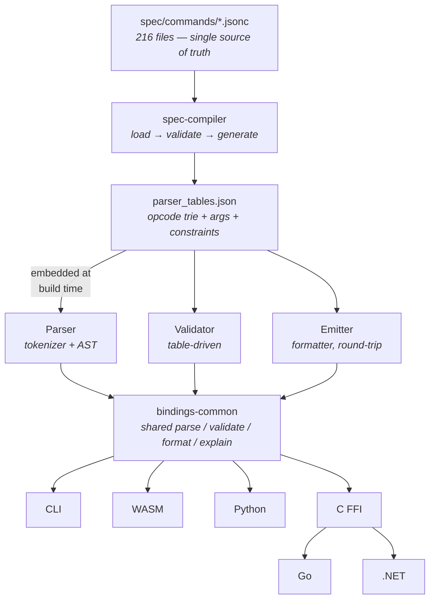

# zpl-toolchain

A spec-first, offline, deterministic **ZPL II toolchain** — parse, validate, format, and lint Zebra Programming Language files with a Rust core and bindings for TypeScript, Python, Go, and .NET.

## Features

- **Full ZPL II command coverage** — 223/223 commands (100%) across 216 per-command spec files, each audited against the official Zebra Programming Guide
- **Hand-written parser** — opcode trie for longest-match, signature-driven argument parsing, prefix/delimiter state tracking, UTF-8 safe, lossless round-tripping
- **Table-driven validator** — arity, types, ranges, enums, cross-command state, constraint DSL (`requires`, `incompatible`, `order`, `emptyData`), profile-aware bounds checking
- **Auto-formatter** — spec-driven, configurable indentation (none / label / field), trailing-arg trimming
- **Printer profiles** — 11 shipped profiles covering desktop, industrial, and mobile Zebra printers with DPI, page bounds, speed/darkness ranges, and hardware feature gates
- **42 diagnostic codes** — structured errors/warnings with byte-offset spans, coloured source annotations via `ariadne`, and `explain` for every code
- **Language bindings** — unified 5-function API (parse, parseWithTables, validate, format, explain) across WASM, Python, C FFI, Go, and .NET
- **CLI** — `parse`, `syntax-check`, `lint`, `format`, `coverage`, `explain` with `--output pretty|json` auto-detection
- **Zero clippy warnings, 307 passing tests** — parser, validator, emitter round-trips, golden snapshots, fuzz smoke tests, profile constraints, barcode data validation, and more

## Architecture



## Installation

### CLI

```bash
cargo install zpl_toolchain_cli
```

### Rust library

```bash
cargo add zpl_toolchain_core
```

### TypeScript / JavaScript (WASM)

```bash
npm install @zpl-toolchain/core
```

### Python

```bash
pip install zpl-toolchain
```

## Getting started

### 1. Build parser tables

```bash
cargo run -p zpl_toolchain_spec_compiler -- build --spec-dir spec --out-dir generated
```

### 2. Parse, lint, format

Parser tables are embedded at compile time (after step 1), so `--tables` is optional.

```bash
# Parse a ZPL file → AST JSON
cargo run -p zpl_toolchain_cli -- parse samples/usps_surepost_sample.zpl

# Lint (parse + validate) with a printer profile
cargo run -p zpl_toolchain_cli -- lint samples/usps_surepost_sample.zpl \
  --profile profiles/zebra-generic-203.json

# Auto-format a ZPL file
cargo run -p zpl_toolchain_cli -- format samples/usps_surepost_sample.zpl

# Explain a diagnostic code
cargo run -p zpl_toolchain_cli -- explain ZPL1401
```

### 3. Run tests

```bash
cargo run -p zpl_toolchain_spec_compiler -- build --spec-dir spec --out-dir generated
cargo nextest run --workspace    # or: cargo test --workspace
```

## CLI reference

```bash
zpl parse <file.zpl>                                        # Parse → AST JSON
zpl syntax-check <file.zpl>                                 # Quick syntax check
zpl lint <file.zpl> [--profile profiles/zebra-generic-203.json]  # Parse + validate
zpl format <file.zpl> [--write] [--check] [--indent label|field] # Auto-format
zpl coverage --coverage generated/coverage.json [--json]    # Spec coverage report
zpl explain <CODE>                                          # Explain a diagnostic

# Global options
zpl --output pretty|json <command>    # Force output mode (default: auto-detect TTY)
zpl <command> --tables <path>         # Override embedded tables
```

## Language bindings

All bindings expose the same core API: **parse**, **validate**, **format**, **explain**.

| Language | Package | Mechanism |
|----------|---------|-----------|
| TypeScript / JavaScript | [`@zpl-toolchain/core`](packages/ts/core/README.md) | WASM via `wasm-bindgen` |
| Python | [`zpl_toolchain`](crates/python/README.md) | Native via PyO3 / maturin |
| Go | [`zpltoolchain`](packages/go/zpltoolchain/README.md) | cgo over C FFI |
| .NET (C#) | [`ZplToolchain`](packages/dotnet/ZplToolchain/README.md) | P/Invoke over C FFI |
| C | [`zpl_toolchain_ffi`](crates/ffi/README.md) | cdylib + staticlib |

## Printer profiles

Profiles are JSON files describing a Zebra printer's capabilities — DPI, page size, speed/darkness ranges, hardware features, and media support. When passed via `--profile`, the validator enforces printer-specific bounds and hardware feature gates, all data-driven from the spec files.

11 shipped profiles cover popular Zebra printers plus two generic baselines. See the [Profile Guide](docs/PROFILE_GUIDE.md) for details.

## Spec authoring

Each of the 216 commands lives in its own JSONC file under `spec/commands/`. Specs declare the command's signature, typed args with defaults, cross-command state, profile constraints, and a constraint DSL.

```jsonc
// spec/commands/^BC.jsonc (abbreviated)
{ "codes": ["^BC"], "name": "Code 128 Bar Code", "arity": 6,
  "args": [
    { "name": "orientation", "type": "enum", "enum": ["N","R","I","B"], "defaultFrom": "^FW" },
    { "name": "height", "type": "int", "range": [1, 32000], "defaultFrom": "^BY" }
  ],
  "effects": { "sets": ["barcode.moduleWidth"] }
}
```

See the [Spec Authoring Guide](docs/public/schema/SPEC_AUTHORING.md) for the full reference.

## Repo layout

```
zpl-toolchain/
  crates/
    core/              Parser, validator, emitter, AST
    cli/               zpl CLI (parse/lint/format/coverage/explain)
    diagnostics/       Diagnostic codes and severity (auto-generated)
    spec-tables/       Shared types (CommandEntry, Arg, Constraint, etc.)
    spec-compiler/     zpl-spec-compiler (validate specs, generate tables)
    profile/           Printer profile loading and validation
    bindings-common/   Shared logic for all language bindings
    wasm/              WASM bindings
    python/            Python bindings (PyO3)
    ffi/               C FFI (cdylib + staticlib)
  packages/
    ts/core/           TypeScript wrapper (@zpl-toolchain/core)
    go/zpltoolchain/   Go wrapper (cgo)
    dotnet/ZplToolchain/  .NET wrapper (P/Invoke)
  spec/
    commands/          216 per-command JSONC files
    schema/            JSONC schema + profile schema
  profiles/            11 shipped printer profiles
  samples/             Sample ZPL label files
  generated/           Build artifacts (gitignored)
  docs/                ADRs, guides, references
```

## Documentation

| Document | Description |
|----------|-------------|
| [CHANGELOG.md](CHANGELOG.md) | Release history |
| [CONTRIBUTING.md](CONTRIBUTING.md) | Development workflow and guidelines |
| [Profile Guide](docs/PROFILE_GUIDE.md) | Printer profile system reference |
| [Spec Authoring Guide](docs/public/schema/SPEC_AUTHORING.md) | How to write command specs |
| [Schema Overview](docs/public/schema/SCHEMA.md) | JSONC schema reference (v1.1.1) |
| [Diagnostic Codes](docs/DIAGNOSTIC_CODES.md) | All 42 diagnostic codes explained |
| [Barcode Data Rules](docs/BARCODE_DATA_RULES.md) | Barcode field data validation |
| [State Map](docs/STATE_MAP.md) | Cross-command state tracking |
| [Release Process](docs/RELEASE.md) | Automated release workflow and publishing |
| [ADR Index](docs/adr/INDEX.md) | Architecture Decision Records |
| [Backlog](docs/BACKLOG.md) | Future work and task tracking |

## What's next

- Web playground / VS Code extension (leveraging WASM bindings)
- NuGet package publishing (.NET bindings)
- Community-contributed printer profiles
- See [docs/BACKLOG.md](docs/BACKLOG.md) for the full roadmap

## License

Dual-licensed under MIT or Apache-2.0. See [MIT-LICENSE.txt](MIT-LICENSE.txt) and [APACHE-2.0-LICENSE.txt](APACHE-2.0-LICENSE.txt) for details.

## Trademarks

This project is not affiliated with, endorsed by, or sponsored by Zebra Technologies Corporation. "Zebra" and the stylized Zebra head are trademarks of Zebra Technologies Corp., registered in many jurisdictions worldwide. "ZPL" and "ZPL II" refer to the Zebra Programming Language, a product of Zebra Technologies. All other trademarks are the property of their respective owners. This project is an independent, community-developed toolchain that works with ZPL II label files.
