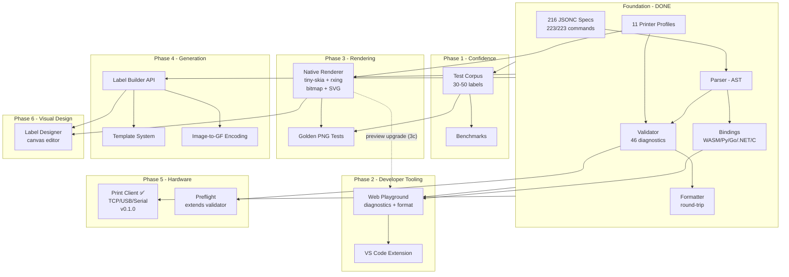

# ZPL Toolchain — Roadmap

> **Status (2026-02-14):** Foundation complete. v0.1.11 published to crates.io, npm, and PyPI. This document captures the long-term vision, organized by phase, with honest assessments of complexity and approach.
>
> For tactical work items, see [BACKLOG.md](BACKLOG.md). For the original (pre-implementation) vision document, see [docs/research/archive/original-implementation-plan.md](research/archive/original-implementation-plan.md).

---

## What Exists Today (Layer 0 — Foundation)

Everything below is **done and shipped**:

- **Spec-first pipeline** — 216 JSONC spec files, 223/223 ZPL II commands (100%), spec-compiler generates parser tables, docs bundle, constraints bundle, coverage report
- **Parser** — hand-written tokenizer + recursive-descent parser, opcode trie (O(k) longest-match), field data mode (`^FD`/`^FV`), raw data mode (`^GF`/`~DG`), prefix/delimiter mutation tracking (`^CC`/`^CD`), lossless round-trip via trivia preservation
- **Validator** — table-driven: type/range/enum/length checking, typed cross-command value state tracking (`defaultFrom` + `defaultFromStateKey`), constraint DSL (`requires`/`incompatible`/`order`/`emptyData`/`note`), profile-aware bounds, printer gates, media validation, barcode field data validation (29 symbologies), 46 diagnostic codes with structured context
- **Formatter** — spec-driven, configurable indentation, trailing-arg trimming, round-trip fidelity
- **Profiles** — 11 printer profiles, hardware feature gates, DPI-dependent defaults, media capabilities
- **CLI** — `parse`, `syntax-check` (`check` alias), `lint` (`validate` alias), `format`, `print`, `explain`, `doctor` with `--output pretty|json`
- **Bindings** — unified 5-function core API across WASM (TypeScript), Python (PyO3), C FFI, Go (cgo), .NET (P/Invoke). Native (non-WASM) targets additionally expose print/status/info APIs with typed and `_with_options` variants for hardware printing
- **CI/CD** — release-plz automation, publishing to crates.io, npm, PyPI, Go module tagging, cross-platform builds
- **DX distribution** — `@zpl-toolchain/cli` npm wrapper enables `npx @zpl-toolchain/cli` without requiring Rust toolchains
- **Hundreds of passing tests** — parser, validator, emitter round-trips, golden snapshots, fuzz smoke tests, print client integration tests, preflight diagnostics, and TypeScript package/runtime coverage

---

## Immediate Priorities

These items can all start now, in parallel, with no dependencies on each other:

| Priority | Item | Phase | Effort | Value |
|----------|------|-------|--------|-------|
| 1 | Test corpus expansion | 1a | 2–4 weeks | Confidence, regression safety |
| 2 | Web playground (diagnostics only) | 2a | 1–2 weeks | Highest visibility, no-install access |
| 3 | VS Code extension MVP | 2b | 1–2 weeks | Daily developer value |
| 4 | ~~TCP print client~~ | 5a | Done (v0.1.0) | End-to-end: lint → print |
| 5 | Performance benchmarks | 1b | 1 week | Baseline before renderer (needs corpus) |

After these, the next major effort is the **native renderer** (3–6 months, incremental).

---

## Phase 1: Deepening & Confidence

**Goal:** Strengthen the foundation before building upward. Low risk, high value. *Start immediately.*

### 1a. Test Corpus Expansion

Expand from 5 samples (141 lines) to 30–50 curated labels. See [CORPUS_EXPANSION_PLAN.md](CORPUS_EXPANSION_PLAN.md) for the detailed plan.

- **Real-world labels** (15–20): curated from open-source repos (zebrash test fixtures, Neodynamic samples, GitHub gists), PII-scrubbed, license-documented
- **Synthetic labels** (15–30): generated from parser tables to exercise specific command families, edge cases, stress scenarios, and prefix/delimiter mutations
- **Benchmarks**: criterion for local perf, iai-callgrind for deterministic CI benchmarks

**Effort:** 2–4 weeks | **Risk:** Low | **Depends on:** Nothing

### 1b. Performance Baseline

- Add criterion benchmarks for parse/validate/format across corpus
- Establish per-label timing thresholds for CI
- Profile before optimizing (the backlog lists several deferred optimizations)

**Effort:** 1 week | **Risk:** Low | **Depends on:** Corpus (1a)

### 1c. Cross-Binding Runtime Test Execution in CI (Completed)

- Added CI jobs that execute wrapper/runtime regression tests for Go and .NET bindings
- Added a Python binding runtime-test job in a PyO3-linkable environment so `cargo test -p zpl_toolchain_python` is enforced (not only `cargo check`)
- Added a dedicated TypeScript core CI job (`ts-core`) that runs type-check/build/test and verifies the package-level init guard behavior
- Added TS print CI integration guards: artifact assertions (`dist/test/mock-tcp-server.js`, `dist/test/network-availability.js`, `dist/test/print.test.js`) plus a local TCP bind precheck so integration suites cannot be silently skipped
- Tightened CI reproducibility and policy gates (`npm ci`, locked FFI release builds, strict spec-table generation, constrained `maturin` install range)
- Keeps confidence coverage focused on preventing wrapper/core behavior drift

**Effort:** 0.5–1 week | **Risk:** Low | **Depends on:** Nothing

---

## Phase 2: Developer Tooling

**Goal:** Make the toolchain visible and useful to developers working with ZPL daily.

### 2a. Web Playground

The lowest-barrier, highest-visibility feature. No install, shareable URLs.

- Monaco or CodeMirror editor with ZPL TextMate grammar
- Live diagnostics using `@zpl-toolchain/core` (WASM)
- Format button
- Hover docs from `docs_bundle.json`

Ships initially as a **diagnostics-only playground** (parse, validate, format, hover docs — all working today via WASM). Label preview is added later when the native renderer (Phase 3) is WASM-ready — this is Phase 3c, which upgrades the same playground with rendered output. No Labelary or third-party renderer dependency.

**Effort:** 1–2 weeks | **Risk:** Low | **Depends on:** Nothing (WASM bindings ready)

### 2b. VS Code Extension (MVP)

Skip full LSP — use WASM directly in the extension host. ZPL files are small (usually <50KB); full reparse on every keystroke is fine.

- **TextMate grammar** for syntax highlighting (ZPL is trivial: `^`/`~` leaders)
- **Diagnostics** on document change via `validate()`, byte spans → VS Code ranges via `LineIndex`
- **Format on save** via `format()`
- **Hover docs** from `docs_bundle.json` (command name, signature, args, description)
- **Explain diagnostic** code action linking to `DIAGNOSTIC_CODES.md`

**Why not LSP:** ZPL is a simple language. The LSP protocol adds JSON-RPC overhead, a separate server process, and maintenance burden — all unnecessary when WASM runs directly in the extension host with sub-millisecond latency.

**Effort:** 1–2 weeks (reuses playground code) | **Risk:** Low | **Depends on:** Nothing

### 2c. VS Code Extension (Enhanced)

Add after MVP proves useful:

- **Quick fixes**: insert missing `^XZ`, add `^PW`/`^LL`, fix barcode data
- **Completions**: command names + signatures from spec tables
- **Profile switcher**: change active printer profile for validation
- **Live preview**: integrate renderer when available (Phase 3)

**Effort:** 2–4 weeks | **Risk:** Medium | **Depends on:** 2b

---

## Phase 3: Rendering

**Goal:** Produce visual output from ZPL — the feature that makes the toolchain dramatically more useful.

### Philosophy: Build Our Own

The original plan considered wrapping existing renderers (zebrash, BinaryKits.Zpl, Labelary). After critical evaluation, we build our own because:

- **No double parsing** — every existing renderer has its own parser. We'd parse ZPL twice. Our parser is more complete (223/223 commands, spec-driven). The renderer consumes our AST directly.
- **Portability** — a Rust renderer compiles to native AND WASM from the same codebase. Same renderer on a website, in a VS Code extension, in a CLI, in a Python script.
- **Profile-aware** — our renderer uses our printer profiles for DPI, page dimensions, and feature gates. No other renderer does this.
- **Correctness foundation** — our validator already tracks all the state the renderer needs (`^BY` defaults, `^CF` font, `^FW` orientation, `^LH` label home, `^PW`/`^LL` bounds). The renderer is a natural extension.

**ULIR: Skip.** The AST + state tracking (`LabelState`, `DeviceState`, `FieldTracker`) is sufficient. The renderer walks the AST the same way the validator does. Add a `ResolvedLayout` type only if visual editing (Phase 6) creates a concrete need.

**Study [BinaryKits.Zpl](https://github.com/BinaryKits/BinaryKits.Zpl)** (.NET, MIT, 388 stars, 561 commits) — the most complete open-source ZPL renderer — for its CommandAnalyzer, ElementDrawer, and font mapping patterns. Build better: spec-driven, profile-aware, portable, complete.

### Rust Crate Ecosystem

All WASM-compatible, actively maintained, permissively licensed:

| Crate | Purpose | License | Notes |
|-------|---------|---------|-------|
| **tiny-skia** (0.12) | 2D bitmap rasterization | MIT/Apache-2.0 | CPU-only Skia subset, ~200KB binary, 1.6M downloads/month, WASM-compatible |
| **resvg** (0.46) | SVG rendering to PNG | MIT/Apache-2.0 | Built on tiny-skia, pixel-perfect cross-platform, 3.6k stars, WASM via `@resvg/resvg-wasm` |
| **rxing** (0.7) | Barcode encode/decode | Apache-2.0 | Port of ZXing: Code 128, QR, DataMatrix, PDF417, Aztec, EAN, UPC, Code 39, ITF. SVG output via `svg_write` feature. WASM via `rxing-wasm` |
| **fontdb** + **rustybuzz** | Font loading/shaping | MIT | Part of the resvg ecosystem. For `^A@` downloadable fonts (later) |
| **image** (0.25) | Image I/O (PNG, JPEG) | MIT/Apache-2.0 | Reading/writing rendered output |

### State Tracking Refactor (Completed)

Typed state tracking is now implemented in `crates/core/src/state/` and shared by validator and future renderer work.

Implemented producer value tracking:

- `^BY` → `BarcodeDefaults { module_width, ratio, height }`
- `^CF` → `FontDefaults { font, height, width }`
- `^FW` → `FieldOrientationDefaults { orientation, justification }`
- `^LH` → `LabelHome { x, y }`
- `^PW`/`^LL`/`^PO`/`^PM`/`^LR`/`^LT`/`^LS` → `LayoutDefaults`

Consumer defaults resolve explicitly through spec metadata (`defaultFrom` + `defaultFromStateKey`) and are validated with the same type/range/profile rules as explicit args.

### 3a. Native Renderer (Incremental)

Two rendering backends sharing the same AST-walking + state-tracking core:

**Primary: Direct bitmap via tiny-skia** — render to a pixel buffer (`Pixmap`), closest to what a real printer does (rasterization to dots). Profile DPI determines resolution. Produces PNG output for golden tests and previews. WASM-compatible for browser/extension use.

**Secondary: SVG output** — generate SVG for browser-renderable, human-debuggable output. Useful for the web playground (embed directly in DOM). `rxing`'s `svg_write` feature handles barcode SVG natively.

Build incrementally by command family:

1. **Geometry**: `^GB`, `^GC`, `^GD`, `^GE` — simple shapes via tiny-skia. **1 week**
2. **Text**: `^A` device fonts — embed font metrics per printer family (A–Z, 0–9), `^CI` code pages, 0/90/180/270 rotation. **2–3 weeks**
3. **Barcodes**: Code 128 (`^BC`), QR (`^BQ`) via rxing — most common symbologies first. **2–3 weeks**
4. **Graphics**: `^GF` decode — ASCII hex, binary, ACS compression, Z64. **2–3 weeks**
5. **Layout**: `^FO`/`^FT` positioning, `^FW` rotation, `^FB` text blocks, `^LH` label home. **2–3 weeks**
6. **Remaining barcodes**: DataMatrix, PDF417, Aztec, EAN, etc. via rxing. **4–6 weeks**
7. **Advanced**: `^FR` (field reverse), `^A@` (downloadable fonts), `^GS` (graphic symbols). **Ongoing**

```
crates/
  renderer/               # New workspace crate (publish = false initially)
    Cargo.toml             # deps: tiny-skia, rxing, image
    src/
      lib.rs               # Public API: render_bitmap(), render_svg()
      bitmap.rs            # tiny-skia bitmap backend
      svg.rs               # SVG string generation backend
      text.rs              # Device font metrics and glyph rendering
      barcode.rs           # Barcode rendering (wraps rxing)
      graphics.rs          # ^GF decode (ASCII hex, binary, ACS, Z64)
      geometry.rs          # ^GB, ^GC, ^GD, ^GE
      layout.rs            # AST walker + state tracking (shared with validator)
      fonts/               # Embedded device font metric data
```

The `layout.rs` module shares state-tracking patterns with the validator. When mature, factor the shared code into a common module both consume.

A dedicated renderer planning doc (`docs/RENDERER_PLAN.md`) will be created before implementation begins, and its prerequisite research checklist is tracked in `docs/BACKLOG.md` under "Renderer Prerequisite: Research & Decision Gate".

**Effort:** 3–6 months (incremental) | **Risk:** Medium | **Depends on:** Nothing (can start anytime)

### 3b. Golden PNG Test Suite

- Render all corpus labels to PNG via our renderer
- Store as golden fixtures in CI (visual regression testing)
- Compare our output against Labelary and/or BinaryKits.Zpl for validation
- Barcode verification: decode rendered barcodes via `rxing`, validate data integrity

**Effort:** 1–2 weeks | **Risk:** Low | **Depends on:** 3a

### 3c. Playground Preview Upgrade

This is NOT a separate app — it upgrades the existing Phase 2a playground with rendering capabilities. Inspired by [XaViewer](https://github.com/Fabrizz/zpl-renderer-js) (Fabrizz/zpl-renderer-js):

- **Profile/DPI/label-size selector** (uses our existing 11 printer profiles)
- Live rendered preview (powered by our WASM renderer, replacing the diagnostics-only view)
- Multi-label support

The playground architecture (Phase 2a) is designed so the renderer slots in with zero rearchitecting — just add the WASM renderer as a dependency and wire up the preview pane.

**Effort:** 1 week | **Risk:** Low | **Depends on:** 2a (playground), 3a (renderer)

### How Everything Cooperates



---

## Phase 4: Generation & Templates

**Goal:** Produce ZPL programmatically — the other direction from parsing.

### 4a. Label Builder API

A Rust API for constructing valid ZPL labels programmatically:

```rust
let label = LabelBuilder::new()
    .page(width_mm: 100, height_mm: 50, dpi: 203)
    .text("Sample ID: ABC-123", x: 10, y: 10, font: 'A', height: 30)
    .barcode(Symbology::Code128, "ABC123", x: 10, y: 50, height: 80)
    .qr_code("https://example.com", x: 200, y: 10, magnification: 5)
    .build(); // → String (valid ZPL)
```

Uses spec tables to ensure generated ZPL is valid. Exposed through all bindings.

**Effort:** 3–4 weeks | **Risk:** Low | **Depends on:** Nothing (uses existing emitter)

### 4b. Template System

Variable substitution in ZPL files (`.zplt` template format):

```zpl
^XA
^FO50,50^A0N,30,30^FD${patient_name}^FS
^FO50,100^BQN,2,5^FDMA,${sample_id}^FS
^XZ
```

- JSON Schema for template inputs (type checking, required fields)
- Deterministic transforms (date formatting, uppercase, checksums)
- Batch rendering with data arrays

**Effort:** 2–3 weeks | **Risk:** Low | **Depends on:** Nothing

### 4c. Image-to-`^GF` Encoding

Convert images (PNG, JPEG, BMP) and PDFs into ZPL `^GF` graphic fields for embedding logos, photos, and complex graphics in labels. This is a core utility — nearly every label with a logo needs it.

```rust
let gf = encode_image("logo.png", &EncodingOptions {
    dpi: 203,
    compression: Compression::Z64,  // or ACS
    threshold: 128,                 // blackness threshold
    dither: Dither::FloydSteinberg, // or Ordered, Threshold
    trim_whitespace: true,
    rotation: Rotation::None,
})?; // → String ("^GFA,...")
```

- **Grayscale conversion** with configurable blackness threshold
- **Dithering**: Floyd-Steinberg, ordered, simple threshold
- **Compression**: ACS (run-length, universal printer support) and Z64 (zlib, better compression, newer printers)
- **Auto-trim** whitespace around edges
- **Orthogonal rotation** (0/90/180/270) — ZPL can't rotate `^GF` at format time
- **CLI command**: `zpl-toolchain encode-image logo.png --dpi 203 --compression z64`
- **Rasterize-to-`^GF` fallback**: accept any bitmap buffer, enabling a "whole-label-as-image" escape hatch for content that can't be natively expressed in ZPL

Exposed through all bindings. The algorithms are well-documented in the ZPL Programming Guide and multiple open-source implementations exist to study (zpl-image, zplgfa, zebrafy).

**Effort:** 2–3 weeks | **Risk:** Low | **Depends on:** Nothing

---

## Phase 5: Hardware Integration

**Goal:** Connect the toolchain to physical printers.

> **Note:** Phase 5a (print client) is low effort and has zero dependencies on rendering or generation. It completes the end-to-end workflow: parse → validate → print. Consider starting it alongside Phases 1–2 rather than waiting for the renderer.

### TCP vs SGD — Two Protocols, One Wire

Both ZPL and SGD travel over TCP port 9100:

- **ZPL** (`^XA...^XZ`): 223 commands for label content. This is what we've built.
- **SGD** (`! U1 setvar/getvar/do`): Hundreds of key-value settings for device configuration (`device.languages`, `media.type`, `print.tone`, etc.). Model-dependent, scattered documentation.

We build a ZPL print client. SGD is deferred (see Deferred section), but the transport layer is designed with SGD in mind — a simple `printer.send_zpl()` vs a future `printer.send_sgd()` abstraction costs nothing now and avoids a rewrite later. Note: `send_sgd()` does not exist today; it is listed here as a future aspiration to show that the transport design accommodates it.

### 5a. Print Client ✅ (Implemented v0.1.0)

> **Implemented 2026-02-08.** TCP, USB, and serial/Bluetooth SPP transports with split `Printer`/`StatusQuery` trait design. See [research/ZPL-PRINT-CLIENT-PLAN.md](research/ZPL-PRINT-CLIENT-PLAN.md) for the design plan and [PRINT_CLIENT.md](PRINT_CLIENT.md) for the user-facing guide.

The `crates/print-client/` crate provides:

- **Three transports**: TCP (port 9100, default), USB (`nusb`, feature-gated), Serial/BT SPP (`serialport`, feature-gated)
- **Split trait design**: `Printer` (send-only) + `StatusQuery` (bidirectional) — all transports implement both
- **Status parsing**: `~HS` → `HostStatus` (24 fields), `~HI` → `PrinterInfo` (model, firmware, DPI, memory)
- **STX/ETX frame parser**: byte-level state machine, transport-agnostic (`impl Read`)
- **Retry with exponential backoff**: `RetryPrinter<P>` wrapper, jitter, `is_retryable()` classification; `ReconnectRetryPrinter<P>` with automatic reconnection via `Reconnectable` trait
- **CLI integration**: `zpl print <file.zpl> --printer <addr>` with `--no-lint`, `--strict`, `--dry-run`, `--status`, `--wait`
- **Bindings**: `print_zpl[_with_options]()` plus `query_printer_status[_with_options]()` and `query_printer_info[_with_options]()` in bindings-common (cfg-gated, not WASM); Go/.NET wrappers expose raw + typed query helpers
- **TypeScript**: separate `@zpl-toolchain/print` package (pure TS, `node:net`, browser proxy with WebSocket support); batch API (`printBatch(labels, opts?, onProgress?)`, `waitForCompletion()`) with `BatchOptions`/`BatchProgress`/`BatchResult` types

**Effort:** Done | **Risk:** — | **Depends on:** Nothing

### 5b. Preflight (Initial Implementation Done)

Analyze a label before sending to printer. Initial preflight diagnostics are implemented:

- [x] **ZPL2308** — Graphics bounds (`^GF` exceeds printable area based on `^PW`/`^LL` or profile page bounds)
- [x] **ZPL2309** — Graphics memory estimation (`^GF` total memory exceeds printer RAM from profile)
- [x] **ZPL2310** — Missing explicit label dimensions (`^PW`/`^LL` commands)
- [ ] Object bounds checking (text/barcode overflow)
- [ ] Media mode sanity (`^MN`/`^MT`/`^MM` vs profile)
- [ ] Missing required commands

This is an extension of the validator, not a new system. The initial implementation covers graphics-related preflight checks (10 tests). Remaining items extend the same pattern.

**Effort:** 1–2 weeks (remaining items) | **Risk:** Low | **Depends on:** Nothing (extends validator)

### 5c. Printer Discovery & Emulator

- **Discovery**: mDNS/Bonjour for network printers
- **Emulator**: virtual printer on port 9100, renders incoming ZPL (requires renderer)

**Effort:** 4–8 weeks | **Risk:** Medium | **Depends on:** 5a, 3a (renderer)

---

## Phase 6: Visual Design (Long-term)

**Goal:** WYSIWYG label designer — the capstone product.

### 6a. VS Code Designer Panel

Split view: ZPL code editor ↔ visual canvas. Edit either side, round-trip via generator + renderer.

- Drag-and-drop primitives (text, barcode, graphic, box)
- Snap-to-grid, alignment guides
- Profile-aware bounds visualization
- Template data preview

**Depends on:** Renderer (3a), Generator (4a) | **Risk:** High | **Effort:** 3–6 months

### 6b. Standalone Web Designer

Browser-based label designer using WASM bindings. Same engine as VS Code panel but standalone.

**Depends on:** 6a, Playground (2a) | **Risk:** High | **Effort:** 3–6 months

---

## Deferred / Dropped Ideas

Ideas from the original plan that we've consciously decided to defer or drop, with rationale:

### Deferred

| Idea | Rationale | Revisit When |
|------|-----------|--------------|
| **ULIR** (Unified Label IR) | The AST + state tracking is sufficient for rendering. Add a `ResolvedLayout` type only if visual editing or cross-backend support creates a concrete need. | If building a visual designer (Phase 6) |
| **Multi-backend IR** (EPL/TSPL/ESC-POS) | Transpiling between fundamentally different printer languages is unproven and premature. Each language has unique semantics. | If there's real demand, build separate adapters (AST → EPL), not a universal IR |
| **Schema v2** | Current v1.1.1 schema works well. The proposal adds complexity (opcode-keyed maps, paramGroups, familyRegistry) without clear benefit yet. | When the current schema becomes a bottleneck for new features |
| **Label ABI** | Versioned template metadata is useful, but premature before templates exist. | After template system (4b) is proven |
| **BLAKE3 structural hashing** | Nothing to hash yet. Add content-addressed caching when the renderer produces artifacts and caching becomes a measurable need. | After renderer is production-quality |
| **Combo matrices** | The existing constraint DSL (`requires`/`incompatible`) handles cross-command validation well. A separate matrix system adds complexity without clear benefit. | If constraint DSL proves insufficient |
| **NuGet publishing** (.NET) | .NET bindings exist but aren't published to NuGet. Low demand signal so far. | If .NET users request it |
| **SGD support** | SGD (`! U1 setvar/getvar/do`) is a massive, model-dependent key-value store for printer device configuration. Our core value is label correctness, not printer fleet management. The print client's transport layer is designed to be SGD-aware (Phase 5), so adding SGD later doesn't require rearchitecting. Could become a separate crate (`zpl_toolchain_sgd`) sharing the transport layer. | If printer fleet management features are requested |
| **HTML/CSS label authoring** | Design labels using HTML/CSS/Tailwind and convert to ZPL. Three possible approaches: (A) rasterize HTML to bitmap → `^GF` (simple but entire label is one image), (B) semantic mapping of HTML elements to ZPL commands (extremely complex — CSS layout is massive), (C) constrained label DSL using HTML syntax with ZPL-specific components. Approach A is enabled by image encoding (4c); approaches B/C need the visual designer infrastructure. Inspired by zplbox and Universal-ZPL-Generator. | After Phase 6 visual designer proves the "high-level → ZPL" concept |
| **PDF-to-ZPL conversion** | Convert PDF pages to ZPL labels (page → bitmap → `^GF`). Useful for legacy label designs that exist only as PDFs. Straightforward once image encoding (4c) exists — just need a PDF rasterizer (Rust crates: `pdf-render`, `pdfium-render`). Inspired by PDFtoZPL and zebrafy. | After image encoding (4c) is complete |

### Dropped

| Idea | Rationale |
|------|-----------|
| **WASM Rulelets** | Enterprise fantasy. Sandboxed WASM modules with ABI versioning, quotas, and allowlists — for custom lint rules that nobody has asked for. If custom rules are needed, config files or Rust plugins are simpler. ESLint plugins aren't WASM modules. |
| **Query/Response schemas** (`~HM`, `~HS`, `~HQES`) | Niche. Parsing printer status responses belongs in a printer management tool, not a ZPL parser/validator. The print client (5a) can send `~HS` and parse the response without a formal schema system. |
| **Full LSP server** | Unnecessary for ZPL. WASM runs directly in the VS Code extension host with sub-millisecond latency. The LSP protocol adds JSON-RPC overhead, a separate process, and maintenance burden. Direct WASM integration is simpler and faster. |
| **"Micro-kernel" plugin architecture** | The current module structure (parser, validator, emitter, bindings) is already well-factored. Don't add plugin interfaces until there are multiple implementations to swap. |
| **Deterministic clock / security theater** | Input size limits and log redaction are good practice. "Deterministic clock for templates" and enterprise security features are premature. Add them if a real security audit demands them. |

---

## Dependency Graph

```
Done:
  Phase 5a: Print Client ✅ (TCP/USB/serial, CLI, bindings, TypeScript)

Immediate (can all start now):
  Phase 1: Corpus ──── Benchmarks
  Phase 2: Playground (diagnostics) ──── VS Code MVP ──── Enhanced

Medium-term:
  Phase 3: Native Renderer ──── Golden PNGs
                                      │
                                      └──── Playground Preview Upgrade (3c)
  Phase 4: Label Builder ──── Template System ──── Image Encoding

Later:
  Phase 5b: Preflight ──── 5c: Emulator (needs renderer)
  Phase 6: VS Code Designer ──── Web Designer (needs renderer + builder)
```

Phase 5a is complete. Phases 1, 2, and 4 are fully independent and can proceed in parallel. Phase 3c upgrades the Phase 2a playground (same app, not separate). Phase 5c and Phase 6 depend on the renderer.

---

## Guiding Principles (refined from original plan)

1. **Spec-first, data-driven** — parser tables, validator rules, docs, and completions all derive from the same JSONC spec files
2. **Ship incrementally** — every phase delivers standalone value; no "big bang" releases
3. **The AST is the universal interface** — the renderer, generator, preflight, and print client all consume the same AST. No ULIR, no separate IR. The AST + state tracking is the shared foundation
4. **Own the renderer** — build it in Rust, portable to WASM. Study BinaryKits.Zpl for inspiration, but build better (spec-driven, profile-aware, complete command coverage). No third-party renderer dependencies
5. **Profile-aware everywhere** — the renderer uses printer profiles for DPI, page dimensions, and feature gates. The web playground exposes a profile switcher. The validator and renderer share the same profile data
6. **Shared state tracking** — the renderer walks the AST the same way the validator does. Both need `^BY` defaults, `^CF` font, `^FW` orientation, `^LH` label home, `^PW`/`^LL` bounds. Factor this into a shared module
7. **SGD-aware transport** — the print client uses TCP 9100 for ZPL delivery. The transport abstraction is kept clean enough that SGD commands could plug in later without rearchitecting. SGD itself is deferred, not dropped
8. **Proven crates for hard problems** — `rxing` for barcodes, `tiny-skia` for rasterization, `resvg` for SVG-to-PNG. Don't reinvent what's already solved well in Rust
9. **Offline by default** — every feature works without network; remote services are opt-in
10. **Deterministic outputs** — same input → same output, regardless of platform or concurrency
11. **Small sharp tools** — each sub-tool (parse, validate, format, render, print) is useful alone and composes cleanly

---

## Version History

| Date | Change |
|------|--------|
| 2026-02-08 | Implemented Phase 5a: print client with TCP/USB/serial transports, split Printer/StatusQuery trait design, STX/ETX frame parser, ~HS/~HI status parsing, retry with exponential backoff, CLI integration (`zpl print`), Python/FFI bindings, TypeScript package. Design doc and user guide added. |
| 2026-02-08 | Council review: clarified Phase 2a/3c relationship (same app, not separate). Removed Labelary dependency. Added state tracking refactor as Phase 3 prerequisite. Elevated Phase 5a (print client) to immediate priorities. Fixed dependency graph and mermaid diagram. Cleaned up backlog conflicts. |
| 2026-02-08 | Added Phase 4c: image-to-`^GF` encoding. Deferred HTML/CSS label authoring and PDF-to-ZPL conversion with clear revisit triggers. |
| 2026-02-08 | Revised Phase 3: native-first renderer (tiny-skia + rxing), no bridge. Added SGD-aware transport to Phase 5. SGD moved from Dropped to Deferred. Expanded architectural principles. |
| 2026-02-08 | Initial roadmap, synthesized from original plan + critical review |
