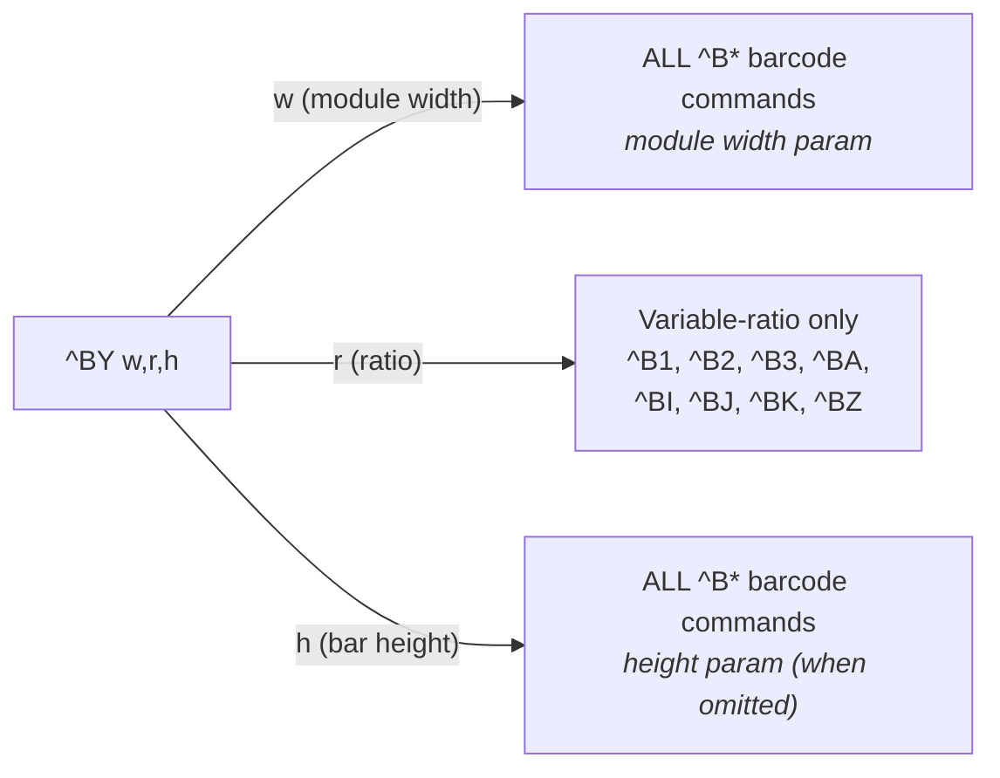
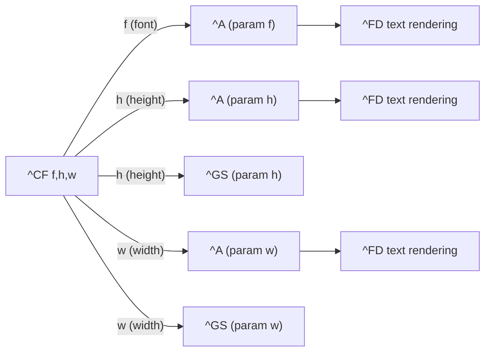
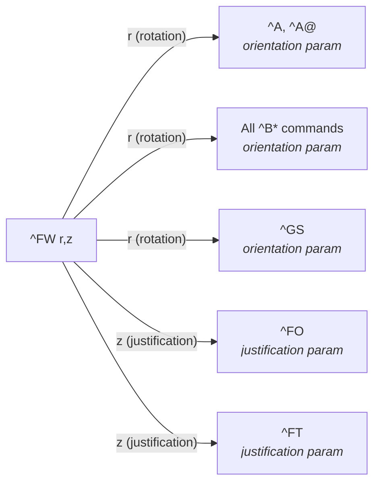
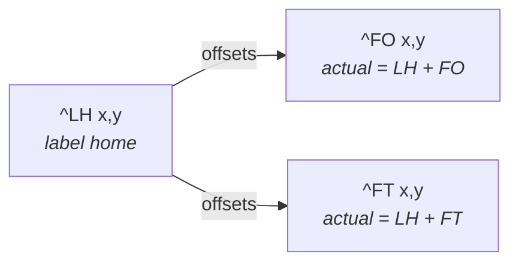
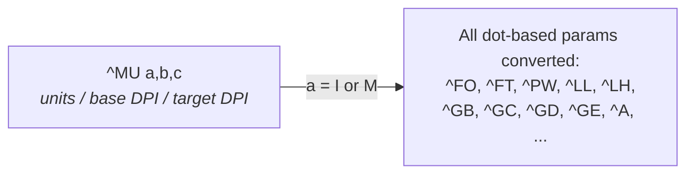

# ZPL Cross-Command State Map

> Reference document mapping all state-setting commands to their consumers.

## Overview

ZPL is a stateful language. Several commands set persistent state that affects the behavior or defaults of subsequent commands. This document catalogs all such relationships to guide schema authoring (via `defaultFrom` and `effects`) and validator implementation.

State scopes (from shortest to longest lifetime):
- **Field**: Affects only the current field (until `^FS`)
- **Document/Label**: Affects the current label (until `^XZ`)
- **Session**: Persists across labels until changed or printer reset
- **System/Device**: Persists until explicitly changed or factory reset

---

## Per-Field State

| Producer | State Set | Consumers | Notes |
|----------|-----------|-----------|-------|
| `^FH` | Hex escape indicator char | `^FD`, `^FV`, `^SN` | Default indicator is `_`; resets at `^FS` |
| `^FR` | Field reverse print (white-on-black) | Current field rendering | Must be specified per-field; for label-wide reverse, use `^LR` |
| `^FC` | Clock indicator chars (primary, secondary, third) | `^FD` with Real-Time Clock data | Must be specified per-field when RTC values are needed |

## Per-Label State

| Producer | State Set | Consumers | Notes |
|----------|-----------|-----------|-------|
| `^BY` | Module width (1–10 dots) | All `^B*` barcode commands | Default: 2; persists until next `^BY` or `^XZ` |
| `^BY` | Wide-to-narrow ratio (2.0–3.0) | Variable-ratio barcodes (`^B1`, `^B2`, `^B3`, `^BA`, `^BI`, `^BJ`, `^BK`, `^BZ`) | Default: 3.0; no effect on fixed-ratio barcodes (`^B7`, `^B8`, `^B9`, `^BC`, `^BE`, etc.) |
| `^BY` | Bar height (dots) | All `^B*` barcode commands | Default: 10; used when barcode h param is not specified |
| `^CF` | Default font name | `^A` (font param `f`) | Default: font `A`; also affects `^A@` if no font name given |
| `^CF` | Default font height | `^A` (height param `h`), `^GS` (height param `h`) | In dots; power-up default: 9 |
| `^CF` | Default font width | `^A` (width param `w`), `^GS` (width param `w`) | In dots; power-up default: 5 |
| `^FW` | Default field orientation | `^A` (orientation `o`), all `^B*` (orientation `o`), `^GS` (orientation `o`) | Values: `N`, `R`, `I`, `B`; Default: `N` |
| `^FW` | Default field justification | `^FO` (justification `z`), `^FT` (justification `z`) | Values: `0` (left), `1` (right), `2` (auto); firmware V60.14.x+ |
| `^PW` | Print width | Layout bounds checking | In dots; bounded by printhead width |
| `^LL` | Label length | Layout bounds checking, continuous media sizing | In dots; not persistent across power cycle unless `^JUS` sent |
| `^LH` | Label home x,y | `^FO`, `^FT` (positions are relative to label home) | Default: 0,0; should be one of the first commands in format |
| `^PO` | Print orientation | All rendering | Values: `N` (normal), `I` (inverted); inverts x,y coordinates |
| `^LR` | Label reverse print | All rendering (equivalent to `^FR` on every field) | `Y`/`N`; remains active until `^LRN` or power-off |
| `^PM` | Print mirror image | All rendering | `Y`/`N`; flips image left-to-right; remains active until `^PMN` or power-off |
| `^LT` | Label top offset | All rendering (vertical shift) | Range: -120 to 120 dot rows (varies by printer) |
| `^LS` | Label shift | All field positions (horizontal shift) | Range: -9999 to 9999 dots; retained until power-off or new `^LS` |
| `^MC` | Map clear (bitmap retain) | Label rendering pipeline | `N` retains bitmap for next label; default: `Y` (clear) |
| `^PA` | Advanced text properties (bidi, shaping, OpenType) | Text rendering (`^A`, `^A@`, `^TB`, `^FB`) | Firmware V60.14.x+; configures glyph, bidi, shaping, OpenType |
| `^CV` | Code validation on/off | All `^B*` barcode commands | `Y`/`N`; remains active from format to format until turned off |

## Per-Session State

| Producer | State Set | Consumers | Notes |
|----------|-----------|-----------|-------|
| `^CC` / `~CC` | Command prefix char | Parser (all `^` command recognition) | Default: `^`; takes immediate effect |
| `^CD` / `~CD` | Delimiter char | Parser (parameter separation) | Default: `,`; requires `^JUS` to persist across power cycle |
| `^CI` | Character encoding / code page | `^FD`, `^FV`, text rendering | Default: `0` (USA1); values 0–36; see International Character Sets |
| `^CT` / `~CT` | Control command prefix | Parser (all `~` control command recognition) | Default: `~`; takes immediate effect |
| `^CW` | Font identifier reassignment | `^A` (font param `f`) | Maps a single letter to a downloaded font; persists until power-off |
| `^SE` | Active encoding table (.DAT) | Font rendering (TrueType conversion) | Selects which .DAT table is active for character mapping |
| `^FL` | Font linking table | Font rendering (glyph fallback chain) | Links extension fonts to base fonts; persists until power-off or `^JUS` |
| `^JZ` | Reprint-after-error mode | Label reprint on error recovery | `Y`/`N`; persists until another `^JZ` or power-off |
| `^CO` | Character cache size | Scalable font performance | Resized as needed; characters lost on resize |

## System/Device State

| Producer | State Set | Consumers | Notes |
|----------|-----------|-----------|-------|
| `^MU` | Unit of measure | All dot-based params (`^FO`, `^FT`, `^PW`, `^LL`, `^LH`, `^GB`, `^GC`, `^GD`, `^GE`, etc.) | Values: `D` (dots), `I` (inches), `M` (mm); field-by-field basis |
| `^MD` | Media darkness (relative adjustment) | All print operations | -30 to +30 relative to current darkness setting |
| `~SD` | Media darkness (absolute) | All print operations | 00 to 30; `^MD` value is added to `~SD` value |
| `^PR` | Print speed, slew speed, backfeed speed | All print operations | In inches per second; persists until reissued or power-off |
| `^MM` | Print mode | Media handling | `T` (tear-off), `P` (peel), `R` (rewind), `C` (cutter), `D` (delayed cut), `A` (applicator), `K` (kiosk), `F` (RFID) |
| `^MN` | Media tracking mode | Media sensing / calibration | `N` (continuous), `Y`/`W` (web), `M` (mark), `A` (auto-detect), `V` (continuous variable-length) |
| `^MT` | Media type | Media sensing (ribbon detection) | `T` (thermal transfer), `D` (direct thermal) |
| `^CM` | Memory device alias mapping | All file operations (`~DG`, `^XG`, `^A@`, `^DF`, `^XF`, `^IM`, `^IL`, `^IS`, `^ID`, etc.) | Reassigns B:/E:/R:/A: letter designations; requires `^JUS` to save |
| `^SC` | Serial port settings | Serial communication | Baud, data bits, parity, stop bits, protocol, Zebra protocol |
| `^MF` | Media feed action | Power-up / head-close behavior | Feed mode at power-up and after head close |
| `^JT` | Printhead test interval | Printhead diagnostics | 0000–9999 labels between tests; `0000` = off |
| `^MP` | Mode protection | Control panel access | Disables specific control panel modes |
| `^KL` | Display language | Control panel LCD | 1–20 (English, Spanish, French, etc.) |
| `^KN` | Printer name / description | Network identification, web page | Up to 16-char name + 35-char description; requires `^JUS` |
| `^KP` | Control panel password | Control panel access | 4-digit password; default: 1234 |
| `^KD` | Date/time display format | Configuration label, LCD | 0–4; requires Real-Time Clock hardware |
| `~JS` | Backfeed sequence | Label positioning | `A`/`B`/`N`/`O` or 10–90 percent value |

---

## Detailed State Flow Diagrams

### `^BY` → `^B*` Cluster (Barcode Defaults)



> **Note:** Ratio is ignored by fixed-ratio barcodes (`^B7`, `^B8`, `^B9`, `^BC`, `^BD`, `^BE`, `^BQ`, `^BX`).

### `^CF` → `^A` Cluster (Font Defaults)



### `^FW` → Orientation Cluster



### `^LH` → Positioning



### `^MU` → Unit Conversion



---

## Cross-Reference: Barcode Commands and Their `^BY` / `^FW` Dependencies

| Barcode | Name | Orientation from `^FW`? | Height from `^BY`? | Ratio from `^BY`? | Notes |
|---------|------|:-----------------------:|:------------------:|:------------------:|-------|
| `^B0` | Aztec | Yes | Yes (symbol height) | No | 2D symbology |
| `^B1` | Code 11 | Yes | Yes | Yes | Variable ratio |
| `^B2` | Interleaved 2 of 5 | Yes | Yes | Yes | Variable ratio |
| `^B3` | Code 39 | Yes | Yes | Yes | Variable ratio |
| `^B4` | Code 49 | Yes | Yes | No | Fixed ratio |
| `^B5` | Planet Code | Yes | Yes | No | Fixed ratio |
| `^B7` | PDF417 | Yes | Yes (row height) | No | Fixed ratio; module width from `^BY` |
| `^B8` | EAN-8 | Yes | Yes | No | Fixed ratio |
| `^B9` | UPC-E | Yes | Yes | No | Fixed ratio |
| `^BA` | Code 93 | Yes | Yes | Yes | Variable ratio |
| `^BB` | CODABLOCK | Yes | Yes | Partial | Mode A only; E/F fixed |
| `^BC` | Code 128 | Yes | Yes | No | Fixed ratio |
| `^BD` | UPS MaxiCode | Yes | No | No | Fixed-size 2D symbol |
| `^BE` | EAN-13 | Yes | Yes | No | Fixed ratio |
| `^BF` | MicroPDF417 | Yes | Yes | No | Fixed ratio |
| `^BI` | Industrial 2 of 5 | Yes | Yes | Yes | Variable ratio (2.0:1–3.0:1) |
| `^BJ` | Standard 2 of 5 | Yes | Yes | Yes | Variable ratio (2.0:1–3.0:1) |
| `^BK` | ANSI Codabar | Yes | Yes | Yes | Variable ratio |
| `^BL` | LOGMARS | Yes | Yes | Yes | Variable ratio |
| `^BQ` | QR Code | Yes | No | No | 2D symbology; magnification only |
| `^BR` | GS1 DataBar | Yes | Yes | No | Magnification-based |
| `^BS` | UPC/EAN Extensions | Yes | Yes | No | Fixed ratio |
| `^BT` | TLC39 | Yes | Yes | No | Composite symbology |
| `^BU` | UPC-A | Yes | Yes | No | Fixed ratio |
| `^BX` | Data Matrix | Yes | Yes (symbol) | No | 2D symbology |
| `^BZ` | POSTAL | Yes | Yes | Yes | Variable ratio (2.0:1–3.0:1) |

---

## Implementation Priority

For validator state tracking, implement in this order:

1. **`^BY` → `^B*` cluster** (barcode defaults) — most commonly used, well-understood; three state values fan out to all barcode commands
2. **`^CF` → `^A` cluster** (font defaults) — simple, one producer / few consumers; three state values (font, height, width)
3. **`^FW` → orientation cluster** (field orientation + justification) — small fan-out to `^A`, `^A@`, all `^B*`, `^FO`, `^FT`
4. **`^LH` → positioning** (label home offset) — affects `^FO`/`^FT` interpretation; mechanical addition
5. **`^MU` → units** (unit system) — pervasive but mechanical conversion; affects nearly all dot-valued params

Parser-level state (`^CC`, `^CD`, `^CT`) requires changes to the tokenizer/lexer, not the validator, and should be handled separately.

---

## Schema Modeling

### State producers use `effects.sets`

```jsonc
// Example: ^BY spec
"effects": { "sets": ["barcode.moduleWidth", "barcode.ratio", "barcode.height"] }
```

### State consumers use `defaultFrom` + `defaultFromStateKey` on args

```jsonc
// Example: ^BC height arg
{
  "name": "height",
  "key": "h",
  "type": "int",
  "defaultFrom": "^BY",
  "defaultFromStateKey": "barcode.height",
  "unit": "dots"
}
```

```jsonc
// Example: ^A orientation arg
{
  "name": "orientation",
  "key": "o",
  "type": "enum",
  "defaultFrom": "^FW",
  "defaultFromStateKey": "field.orientation"
}
```

```jsonc
// Example: ^A font arg
{
  "name": "font",
  "key": "f",
  "type": "enum",
  "defaultFrom": "^CF",
  "defaultFromStateKey": "font.name"
}
```

> Rule: when using `defaultFrom`, always provide `defaultFromStateKey` (and it
> must be a key present in the producer `effects.sets` list).

### Validator tracks state per-label

The validator maintains two state structs:

- **`DeviceState`** — persists across labels for session/device-scoped state (`^MU` unit system, session-scoped producer tracking, DPI from profile).
- **`LabelState`** — reset per label; accumulates state-setting commands and tracks producers/consumers via `effects`.

Additionally, a **`FieldTracker`** manages field-level state within each label (open/close tracking, `^FH` hex escape, `^FN` field numbers, serialization, and active barcode command for `fieldDataRules` validation).

`LabelState` accumulates values from state-setting commands as it walks the label's nodes via typed `value_state`. When validating a consumer command with an unset/empty arg that has `defaultFrom`, it resolves defaults from `value_state` using `defaultFromStateKey`.

```rust
struct LabelState {
    // Cross-command producer values used by validator/renderer:
    // barcode defaults, font defaults, field defaults, label home, layout defaults
    value_state: LabelValueState,
}
```

---

## Appendix: Command Quick Reference

| Command | Full Name | Scope | Persists Across Power Cycle? |
|---------|-----------|-------|:----------------------------:|
| `^BY` | Bar Code Field Default | Label | No |
| `^CC`/`~CC` | Change Caret | Session | No (use `^JUS` to save) |
| `^CD`/`~CD` | Change Delimiter | Session | No (use `^JUS` to save) |
| `^CF` | Change Alphanumeric Default Font | Label | No |
| `^CI` | Change International Font/Encoding | Session | No |
| `^CM` | Change Memory Letter Designation | System | No (use `^JUS` to save) |
| `^CT`/`~CT` | Change Tilde | Session | No (use `^JUS` to save) |
| `^CV` | Code Validation | Session | No |
| `^FH` | Field Hexadecimal Indicator | Field | No |
| `^FW` | Field Orientation | Label | No |
| `^LH` | Label Home | Label | Possibly (last saved value) |
| `^LL` | Label Length | Label | No (use `^JUS` to save) |
| `^LR` | Label Reverse Print | Label | No |
| `^LS` | Label Shift | Label | No |
| `^LT` | Label Top | Label | No |
| `^MC` | Map Clear | Label | No |
| `^MD` | Media Darkness | System | Varies by printer model |
| `^MF` | Media Feed | System | No (use `^JUS` to save) |
| `^MM` | Print Mode | System | No (use `^JUS` to save) |
| `^MN` | Media Tracking | System | No (use `^JUS` to save) |
| `^MT` | Media Type | System | No (use `^JUS` to save) |
| `^MU` | Set Units of Measurement | System | No |
| `^PA` | Advanced Text Properties | Label | No |
| `^PM` | Print Mirror Image | Label | No |
| `^PO` | Print Orientation | Label | No |
| `^PR` | Print Rate | System | Varies by printer model |
| `^PW` | Print Width | Label | Possibly (last saved value) |
| `^SC` | Serial Communications | System | No (use `^JUS` to save) |
| `~SD` | Set Darkness | System | Possibly (last saved value) |
| `^SE` | Select Encoding Table | Session | No |
