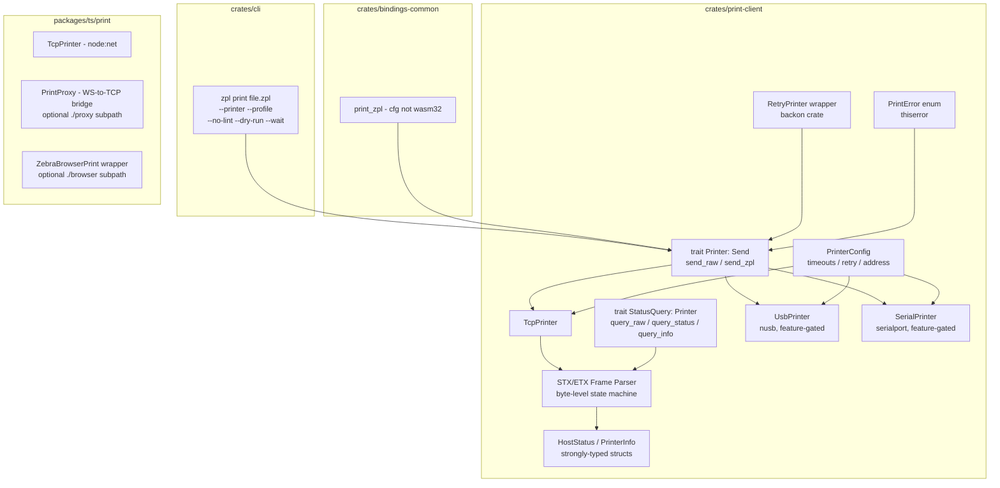

> **Note**: This is the frozen pre-implementation design document. For current
> implementation status, see [BACKLOG.md](../BACKLOG.md) and
> [PRINT_CLIENT.md](../PRINT_CLIENT.md).

---
name: Print Client Refined
overview: Refined, council-reviewed implementation plan for the ZPL Print Client (Phase 5a). Incorporates four transport backends (TCP, USB, serial/BT SPP, BLE stub), a split trait design, Node.js/browser TypeScript package, and comprehensive testing strategy.
todos:
  - id: create-crate
    content: "Create crates/print-client/ with Cargo.toml (feature gates: tcp, usb, serial), add to workspace members, add backon + socket2 to workspace deps"
    status: pending
  - id: traits-and-errors
    content: Implement split Printer + StatusQuery traits in lib.rs, PrintError enum in error.rs, PrinterConfig/PrinterTimeouts/RetryConfig in config.rs, resolve_printer_addr() in addr.rs
    status: pending
  - id: frame-parser
    content: Implement STX/ETX byte-level frame parser state machine in frame.rs with frame size limits and timeout handling
    status: pending
  - id: status-parsers
    content: Implement HostStatus and PrinterInfo strongly-typed parsers in status.rs with unit tests against real ~HS/~HI fixtures
    status: pending
  - id: tcp-transport
    content: "Implement TcpPrinter in tcp.rs: ToSocketAddrs resolution, connect_timeout, TCP_NODELAY, TCP_KEEPALIVE via socket2, Drop cleanup, persistent connection, batch send + wait_for_completion"
    status: pending
  - id: usb-transport
    content: "Implement UsbPrinter in usb.rs behind 'usb' feature gate: nusb, find_zebra(), find(vid,pid), Bulk OUT/IN endpoints, detach_and_claim_interface"
    status: pending
  - id: serial-transport
    content: "Implement SerialPrinter in serial.rs behind 'serial' feature gate: serialport crate, open(), list_ports(), BT SPP support"
    status: pending
  - id: retry-wrapper
    content: "Implement RetryPrinter<P: Printer> wrapper in retry.rs using backon with exponential backoff, jitter, is_retryable() filtering"
    status: pending
  - id: cli-command
    content: "Add Print subcommand to CLI: --printer, --profile, --no-lint, --strict, --dry-run, --status, --wait, --timeout, --serial, batch glob support"
    status: pending
  - id: bindings
    content: Add print_zpl() to bindings-common (cfg-gated for non-WASM), wrap in Python/FFI crates
    status: pending
  - id: ts-package
    content: "Create packages/ts/print/ (@zpl-toolchain/print): TcpPrinter class using node:net, one-shot print(), PrintProxy (WS-to-TCP bridge server), ZebraBrowserPrint ./browser subpath, ~HS parser, optional @zpl-toolchain/core peer dep for validated printing"
    status: pending
  - id: docs
    content: Create docs/PRINT_CLIENT_PLAN.md (frozen design doc) and docs/PRINT_CLIENT.md (user-facing guide). Update ROADMAP.md Phase 5a, README CLI reference
    status: pending
  - id: tests
    content: Unit tests for frame parser + status parsers + addr resolution, integration tests with mock TCP server, CLI tests, TypeScript tests
    status: pending
isProject: false
---

# ZPL Print Client — Refined Plan (Council-Reviewed)

## Council Findings Summary

Four research agents stress-tested the original plan. Key findings:

- **Trait design**: Split into `Printer` (send-only) + `StatusQuery` (bidirectional). Not all transports support reads (USB can be unidirectional). Add `Send` bound, skip `Sync`/`Clone`.
- **Connection lifecycle**: Default to persistent connections (per-session, not per-label). Add `Drop` cleanup, `TCP_KEEPALIVE`, `TCP_NODELAY`.
- **STX/ETX parsing**: Must be a byte-level state machine, not a line reader. Frames can split across TCP segments.
- **Address resolution**: Use `ToSocketAddrs` (not `parse::<SocketAddr>`). Default port 9100. Iterate all resolved addresses.
- **Timeouts**: 5s connect, 30s write (not 10s — large `^GF` labels), 10s read (not 3s — mid-print delays).
- **USB**: `nusb` works sync via `.wait()`. Zebra VID `0x0A5F`, USB Printer Class 7, Bulk OUT `0x01` / IN `0x81`.
- **Bluetooth**: No cross-platform BT Classic crate in Rust. **Pragmatic escape hatch**: `serialport` crate handles BT SPP (paired printers appear as serial ports). BLE deferred (2-4 KB/s, Zebra recommends SPP for printing).
- **TypeScript**: Separate `@zpl-toolchain/print` npm package. WASM cannot open TCP sockets in any environment (browser or Node.js), so the Rust print-client is exposed to Python/Go/.NET via `bindings-common` as usual, but TypeScript needs a pure-TS implementation using Node.js `net` module. Browser users get two options: Zebra Browser Print SDK wrapper (`./browser` subpath) and a bundled WebSocket-to-TCP proxy server (`./proxy` subpath) for non-Zebra or SDK-free workflows.
- **Batch printing**: Add optional `wait_for_completion()` and batch progress callback. Don't poll `~HS` after every label.
- **CLI additions**: `--dry-run`, `--strict`, `--wait`, `--timeout`, in addition to existing `--no-lint`.

---

## Architecture (Refined)




---

## 1. Split Trait Design

The original single `Printer` trait is split into two, because not all transports are bidirectional (some USB printers are write-only):

```rust
/// Send data to a printer. All transports implement this.
pub trait Printer: Send {
    fn send_raw(&mut self, data: &[u8]) -> Result<(), PrintError>;

    fn send_zpl(&mut self, zpl: &str) -> Result<(), PrintError> {
        self.send_raw(zpl.as_bytes())
    }
}

/// Query printer status. Only bidirectional transports implement this.
pub trait StatusQuery: Printer {
    /// Send a command and read raw STX/ETX framed response.
    fn query_raw(&mut self, cmd: &[u8]) -> Result<Vec<Vec<u8>>, PrintError>;

    /// Parse ~HS response into typed struct.
    fn query_status(&mut self) -> Result<HostStatus, PrintError> {
        let frames = self.query_raw(b"~HS")?;
        HostStatus::parse(&frames)
    }

    /// Parse ~HI response into typed struct.
    fn query_info(&mut self) -> Result<PrinterInfo, PrintError> {
        let frames = self.query_raw(b"~HI")?;
        PrinterInfo::parse(&frames)
    }
}
```

- `&mut self` is correct (socket state). No `Sync`, no `Clone`.
- `query_raw()` is the transport-level primitive; parsers live in a separate `status` module, not on the trait.
- Default implementations for `query_status()` / `query_info()` mean transport impls only need `send_raw()` + optionally `query_raw()`.

---

## 2. Transport Implementations

### 2a. TCP (core, always enabled)

File: [crates/print-client/src/tcp.rs](crates/print-client/src/tcp.rs)

- `TcpPrinter::connect(addr: impl ToSocketAddrs, config: &PrinterConfig)` — resolves DNS, iterates addresses, connects with timeout
- Default port 9100 via a `resolve_printer_addr()` helper that handles `IP`, `IP:PORT`, `hostname`, `hostname:PORT`
- `TCP_NODELAY` on (avoids 200ms Nagle delay on small labels)
- `TCP_KEEPALIVE` at 60s (prevents idle disconnect on long sessions)
- `Drop` impl calls `shutdown(Both)` for clean disconnection
- Persistent connection: multiple `send_zpl()` calls reuse the same socket. No auto-reconnect — explicit `reconnect()` method
- Implements both `Printer` and `StatusQuery`

### 2b. USB (feature-gated: `usb`)

File: [crates/print-client/src/usb.rs](crates/print-client/src/usb.rs)

Dep: `nusb` (pure Rust, no libusb). Sync via `.wait()` — no async runtime needed.

```rust
pub struct UsbPrinter {
    interface: nusb::Interface,
    ep_out: u8,  // 0x01 typical
    ep_in: Option<u8>,  // 0x81 if bidirectional
}

impl UsbPrinter {
    /// Find first Zebra printer (VID 0x0A5F, class 7).
    pub fn find_zebra() -> Result<Self, PrintError>;

    /// Find by specific VID:PID (for non-Zebra printers).
    pub fn find(vendor_id: u16, product_id: u16) -> Result<Self, PrintError>;
}
```

- Implements `Printer` always. Implements `StatusQuery` only if `ep_in` is `Some` (bidirectional interface, protocol 0x02).
- Linux: `detach_and_claim_interface(0)` to handle kernel driver
- Windows: requires WinUSB driver (document Zadig setup)
- macOS: may need entitlement on 15.3+

### 2c. Serial / BT SPP (feature-gated: `serial`)

File: [crates/print-client/src/serial.rs](crates/print-client/src/serial.rs)

Dep: `serialport` crate (v4.8, cross-platform, mature).

This is the pragmatic Bluetooth escape hatch: when a user pairs a Zebra printer via Bluetooth at the OS level, it appears as a virtual serial port (`/dev/rfcomm0`, `COM5`, etc.). The `serialport` crate handles this transparently.

```rust
pub struct SerialPrinter {
    port: Box<dyn serialport::SerialPort>,
}

impl SerialPrinter {
    pub fn open(path: &str, baud: u32) -> Result<Self, PrintError>;
    /// List available serial ports (helps discovery).
    pub fn list_ports() -> Vec<String>;
}
```

- Default baud: 9600 (Zebra default for serial/BT SPP)
- Implements `Printer` and `StatusQuery` (serial is always bidirectional)
- Also useful for direct serial connections (RS-232), which some industrial Zebra models use

### 2d. BLE (deferred, not in v1)

Zebra's own guidance: "use SPP for printing, BLE for configuration." BLE throughput is 2-4 KB/s (vs 100+ KB/s over SPP/TCP). No cross-platform BT Classic crate exists in Rust. `btleplug` handles BLE but adds complexity for low throughput. Defer until there's demand.

Document the Zebra BLE GATT UUIDs for future reference:

- Service: `38eb4a80-c570-11e3-9507-0002a5d5c51b`
- Write: `38eb4a82-...` (chunk to 512 bytes max)
- Read: `38eb4a81-...`

---

## 3. STX/ETX Frame Parser (Byte-Level State Machine)

File: [crates/print-client/src/frame.rs](crates/print-client/src/frame.rs)

The original plan assumed line-based reading. The council correctly identified this as broken: STX/ETX frames can split across TCP segments. A proper parser:

```rust
enum FrameState { WaitingForStx, ReadingFrame }

fn read_frames(
    stream: &mut impl Read,
    expected_count: usize,
    timeout: Duration,
    max_frame_size: usize,  // 1KB guard
) -> Result<Vec<Vec<u8>>, PrintError>;
```

- Byte-by-byte state machine: skip garbage between frames (CR/LF/noise), collect between STX (0x02) and ETX (0x03)
- Frame size limit (1KB) prevents runaway reads
- Returns exactly `expected_count` frames (3 for `~HS`, 1 for `~HI`)
- `PrintError::MalformedFrame` if frames don't arrive within timeout

---

## 4. Status Structs (Strongly Typed)

File: [crates/print-client/src/status.rs](crates/print-client/src/status.rs)

```rust
pub struct HostStatus {
    // Line 1
    pub paper_out: bool,
    pub paused: bool,
    pub label_length_dots: u32,
    pub formats_in_buffer: u16,
    pub buffer_full: bool,
    pub comm_diag_mode: bool,
    pub partial_format: bool,
    pub corrupt_ram: bool,
    pub under_temperature: bool,
    pub over_temperature: bool,
    // Line 2
    pub function_settings: u8,
    pub head_up: bool,
    pub ribbon_out: bool,
    pub thermal_transfer_mode: bool,
    pub print_mode: PrintMode,
    pub label_waiting: bool,
    pub labels_remaining: u32,
    pub format_while_printing: bool,
    // Line 3
    pub password: u16,
    pub static_ram_installed: bool,
}

pub struct PrinterInfo {
    pub model: String,
    pub firmware: String,
    pub dpi: u16,
    pub memory_kb: u32,
}
```

Parsers live here, not on the trait. `HostStatus::parse(frames: &[Vec<u8>])` handles comma-splitting and positional field extraction.

---

## 5. PrintError Enum

File: [crates/print-client/src/error.rs](crates/print-client/src/error.rs)

```rust
#[derive(Debug, thiserror::Error)]
pub enum PrintError {
    // Connection
    #[error("connection refused: {addr}")]
    ConnectionRefused { addr: String, source: io::Error },
    #[error("connection timed out: {addr} ({timeout:?})")]
    ConnectionTimeout { addr: String, timeout: Duration },
    #[error("connection failed: {addr}")]
    ConnectionFailed { addr: String, source: io::Error },
    #[error("connection closed by printer")]
    ConnectionClosed,

    // Address
    #[error("invalid address: {0}")]
    InvalidAddress(String),
    #[error("no address found for hostname")]
    NoAddressFound,

    // I/O
    #[error("write failed: {0}")]
    WriteFailed(#[source] io::Error),
    #[error("read timed out waiting for response")]
    ReadTimeout,

    // Protocol
    #[error("malformed response frame: {details}")]
    MalformedFrame { details: String },
    #[error("frame too large ({size} bytes, max {max})")]
    FrameTooLarge { size: usize, max: usize },

    // Printer state
    #[error("printer error: {0}")]
    PrinterError(PrinterErrorKind),

    // Retry
    #[error("retries exhausted after {attempts} attempts")]
    RetriesExhausted { attempts: u32, last_error: Box<PrintError> },

    // Preflight
    #[error("preflight validation failed")]
    PreflightFailed,

    // USB-specific
    #[error("USB device not found")]
    UsbDeviceNotFound,
    #[error("USB error: {0}")]
    UsbError(String),

    // Completion
    #[error("timeout waiting for completion ({labels_remaining} labels remaining)")]
    CompletionTimeout { labels_remaining: u32 },
}

impl PrintError {
    pub fn is_retryable(&self) -> bool { /* ... */ }
}
```

---

## 6. PrinterConfig (Revised Timeouts)

File: [crates/print-client/src/config.rs](crates/print-client/src/config.rs)

```rust
pub struct PrinterConfig {
    pub timeouts: PrinterTimeouts,
    pub retry: RetryConfig,
}

pub struct PrinterTimeouts {
    pub connect: Duration,  // default: 5s
    pub write: Duration,    // default: 30s (was 10s — large ^GF labels)
    pub read: Duration,     // default: 10s (was 3s — mid-print delays)
}

pub struct RetryConfig {
    pub max_attempts: u32,      // default: 3
    pub initial_delay: Duration, // default: 500ms
    pub max_delay: Duration,     // default: 10s
    pub jitter: bool,            // default: true
}
```

---

## 7. Batch API

```rust
pub fn send_batch<F>(
    &mut self,
    labels: &[impl AsRef<[u8]>],
    opts: &BatchOptions,
    on_progress: F,
) -> Result<BatchResult, PrintError>
where
    F: FnMut(BatchProgress) -> ControlFlow<(), ()>;

pub fn wait_for_completion(
    &mut self,
    poll_interval: Duration,
    timeout: Duration,
) -> Result<(), PrintError>;
```

- Optional `~HS` polling at configurable intervals (not after every label)
- `BatchResult` reports `sent` count vs `printed` count (if polling was enabled)
- Progress callback allows abort

---

## 8. CLI Integration (Expanded)

```
zpl print file.zpl --printer 192.168.1.55           # lint errors → abort, warnings → print
zpl print file.zpl --printer 192.168.1.55 --no-lint  # skip validation
zpl print file.zpl --printer 192.168.1.55 --strict   # warnings also abort
zpl print file.zpl --printer 192.168.1.55 --dry-run  # validate + resolve, don't send
zpl print file.zpl --printer 192.168.1.55 --status   # query ~HS after sending
zpl print file.zpl --printer 192.168.1.55 --wait     # poll until printer done
zpl print *.zpl --printer 192.168.1.55 --wait         # batch print with globbing
zpl print file.zpl --printer /dev/rfcomm0 --serial    # serial/BT SPP
zpl print file.zpl --printer usb                      # first USB Zebra printer
zpl print file.zpl --printer usb:0A5F:0100            # specific USB VID:PID
```

Default port 9100 for TCP. `--timeout` flag scales all three timeouts proportionally.

---

## 9. TypeScript Package: `@zpl-toolchain/print`

New package at `packages/ts/print/`. Pure TypeScript — uses Node.js `net` module for TCP, with optional browser integrations.

### Why does TypeScript need a separate package?

The print client follows the project's existing binding pattern at the Rust level: `crates/print-client/` is a separate crate, `bindings-common` gains `print_zpl()` (cfg-gated for non-WASM), and Python/Go/.NET get printing through the same thin wrappers they already use. No new packages needed for those languages.

TypeScript is the **only exception** because of a WASM limitation. The WASM module (compiled via `wasm-bindgen`) cannot open TCP sockets in **any** environment — not in the browser and not in Node.js. `std::net::TcpStream` is excluded by `#[cfg(not(target_arch = "wasm32"))]`. So `@zpl-toolchain/core` (the WASM package) cannot carry `print_zpl()`.

For TypeScript users who need printing, we provide a pure TypeScript package using Node.js built-in `net` module. TCP printing is simple enough (~10 lines of core code) that a native Rust binding isn't necessary — and the pure-TS approach is more idiomatic for the Node.js ecosystem.

### Package layout

```
packages/ts/print/
  package.json    # @zpl-toolchain/print, engines: node>=18
  src/
    index.ts      # TcpPrinter, print(), createPrinter()
    proxy.ts      # PrintProxy — WebSocket-to-TCP bridge server
    browser.ts    # ZebraBrowserPrint SDK wrapper
    status.ts     # ~HS response parser
    types.ts      # PrinterConfig, PrintResult, PrinterStatus
```

### Conditional exports

```json
{
  "exports": {
    ".": { "node": "./dist/index.js", "types": "./dist/index.d.ts" },
    "./proxy": { "node": "./dist/proxy.js", "types": "./dist/proxy.d.ts" },
    "./browser": { "default": "./dist/browser.js", "types": "./dist/browser.d.ts" }
  }
}
```

### Node.js API (main export)

For backend TypeScript / Node.js applications:

```typescript
import { print, createPrinter } from '@zpl-toolchain/print';

// One-shot (connect, send, disconnect)
await print(zpl, { host: '192.168.1.55' });

// Persistent connection (for batch printing or status queries)
const printer = createPrinter({ host: '192.168.1.55', timeout: 5000 });
const status = await printer.getStatus();
if (status.ready) await printer.print(zpl);
printer.close();

// With validation (optional peer dep on @zpl-toolchain/core)
import { printValidated } from '@zpl-toolchain/print';
const result = await printValidated(zpl, {
  host: '192.168.1.55',
  validate: true,
  profileJson: '...',
  failOnErrors: true,
});
```

### WebSocket-to-TCP Print Proxy (`./proxy` subpath)

For browser-based applications that need to print to local network printers **without** the Zebra Browser Print agent. A lightweight Node.js server that bridges WebSocket connections from the browser to TCP 9100 on the printer:

```
Browser (WebSocket) → PrintProxy (Node.js) → TCP 9100 → Printer
```

**Server-side setup** (runs on the same network as the printer):

```typescript
import { createPrintProxy } from '@zpl-toolchain/print/proxy';

const proxy = createPrintProxy({
  port: 8150,                   // WebSocket server port
  allowedPrinters: ['192.168.1.*'],  // security: restrict target IPs
  cors: ['https://my-app.com'],     // allowed origins
  maxPayloadSize: '2mb',            // guard against huge payloads
});

proxy.start();
// WebSocket server running on ws://localhost:8150
```

**Client-side usage** (from any browser app):

```typescript
// Browser code — generic WebSocket, no SDK needed
const ws = new WebSocket('ws://print-server.local:8150');
ws.send(JSON.stringify({
  action: 'print',
  printer: '192.168.1.55',
  zpl: '^XA^FO50,50^A0N,30,30^FDHello^FS^XZ',
}));

// Or query status
ws.send(JSON.stringify({ action: 'status', printer: '192.168.1.55' }));
ws.onmessage = (e) => console.log(JSON.parse(e.data));
```

This pattern is inspired by `zpl-js-listener` and `crbnos/zpl-print`, but with security controls (IP allowlist, CORS, payload limits) and bidirectional status querying. It works with **any** ZPL-compatible printer, not just Zebra.

**Key advantages over Zebra Browser Print SDK:**

- No agent installation required on end-user machines
- Works with non-Zebra printers (SATO, Honeywell, TSC, etc.)
- Open source, fully controllable
- Can be deployed on a shared print server for multiple browser clients

### Zebra Browser Print SDK wrapper (`./browser` subpath)

For users who already have the Zebra Browser Print agent installed (common in Zebra-heavy environments). Thin typed wrapper around the `http://127.0.0.1:9100` local agent API:

```typescript
import { ZebraBrowserPrint } from '@zpl-toolchain/print/browser';

if (await ZebraBrowserPrint.isAvailable()) {
  const devices = await ZebraBrowserPrint.discover();
  await ZebraBrowserPrint.print(devices[0], zpl);
  const status = await ZebraBrowserPrint.getStatus(devices[0]);
}
```

- Zero dependencies — just `fetch()` calls to `http://127.0.0.1:9100`
- Typed device/status interfaces matching the Zebra SDK API
- Not a core dependency — an optional convenience for users in Zebra-only environments

### Browser printing decision guide (for docs)


| Approach                              | Requires Install?         | Non-Zebra? | Latency | Best For                      |
| ------------------------------------- | ------------------------- | ---------- | ------- | ----------------------------- |
| **PrintProxy** (`./proxy`)            | Node.js server on network | Yes        | ~5ms    | Web apps with backend access  |
| **Zebra Browser Print** (`./browser`) | Agent on each client      | No         | ~10ms   | Zebra-only kiosk/desktop apps |
| **HTTP POST proxy** (DIY)             | Any HTTP server           | Yes        | ~5ms    | REST-based integrations       |


---

## 10. Feature Gates in Cargo.toml

```toml
[features]
default = ["tcp"]
tcp = []
usb = ["dep:nusb"]
serial = ["dep:serialport"]
# ble = ["dep:btleplug"]  # deferred

[dependencies]
thiserror = { workspace = true }
backon = { workspace = true }
serde = { workspace = true }
serde_json = { workspace = true }
nusb = { version = "0.1", optional = true }
serialport = { version = "4.8", optional = true }
# socket2 for TCP_KEEPALIVE
socket2 = "0.5"
```

This means `cargo add zpl_toolchain_print_client` gets TCP only. USB/serial are opt-in: `cargo add zpl_toolchain_print_client --features usb,serial`.

---

## 11. Crate Structure (Final)

```
crates/print-client/
  Cargo.toml
  src/
    lib.rs          # Public API, Printer + StatusQuery traits, re-exports
    error.rs        # PrintError enum
    config.rs       # PrinterConfig, PrinterTimeouts, RetryConfig
    frame.rs        # STX/ETX byte-level frame parser
    status.rs       # HostStatus, PrinterInfo parsers
    tcp.rs          # TcpPrinter
    usb.rs          # UsbPrinter (cfg feature = "usb")
    serial.rs       # SerialPrinter (cfg feature = "serial")
    retry.rs        # RetryPrinter<P: Printer> wrapper using backon
    addr.rs         # resolve_printer_addr() — IP/hostname/port resolution
```

---

## 12. Documentation Plan

Two documents to create:

- `**docs/PRINT_CLIENT_PLAN.md**`: This plan, refined and frozen as the working design document. Includes architecture diagrams, trait design rationale, transport details, and decision log. Developers reference this while implementing.
- `**docs/PRINT_CLIENT.md**` (user-facing): How to use the print client. CLI examples, TypeScript API examples, USB/serial setup (udev rules, Zadig, etc.), troubleshooting guide. Created during implementation, finalized before release.

---

## 13. Testing Strategy (Expanded)

- **Unit tests**: `HostStatus::parse()` / `PrinterInfo::parse()` with real `~HS`/`~HI` fixtures, frame parser edge cases (split frames, garbage between frames, oversized frames), `resolve_printer_addr()` with all formats, error classification
- **Integration tests**: `TcpPrinter` against a mock `TcpListener` (spawn in test, verify received bytes, send back mock `~HS` response), batch send + `wait_for_completion()` flow
- **CLI tests**: `zpl print --help`, `--dry-run` output, `--no-lint` skips validation, `--strict` aborts on warnings
- **USB tests**: Mock `nusb` (if feasible), otherwise document manual testing procedure
- **TypeScript tests**: Node.js `TcpPrinter` against mock server, `PrintProxy` WebSocket integration test (spawn proxy + mock printer, send from WS client), `@zpl-toolchain/print/browser` type checks
- **No hardware required**: All automated tests use mocks. Manual testing guide for real printers.

---

## 14. Non-Zebra Compatibility

TCP 9100 raw printing is a de facto standard. The print client works with any printer accepting ZPL over TCP/USB/serial:

- **SATO, Honeywell/Intermec, TSC, Citizen, CAB**: All support ZPL emulation mode. `send_zpl()` works as-is.
- `**~HS` parsing**: Zebra-specific. `query_status()` returns `MalformedFrame` for non-Zebra printers (graceful failure, not crash).
- **USB VID**: `find_zebra()` filters by `0x0A5F`. `find(vid, pid)` works for any USB printer.

---

## 15. Roadmap Updates Needed

- Phase 5a in [ROADMAP.md](docs/ROADMAP.md): Update to reflect USB + serial transports, split trait, TypeScript package with print proxy. Mark as "in-progress" when development starts.
- Add `@zpl-toolchain/print` to the npm publishing workflow in [release-plz.yml](.github/workflows/release-plz.yml) when ready.
- Update [README.md](README.md) CLI reference with `zpl print` command after implementation.

---

## 16. Binding Architecture Summary

How printing integrates with the existing binding pattern:

```
Rust Engine Crates:     core          print-client (new)
                          \               /
                       bindings-common
                       (parse, validate, format, explain,
                        print_zpl* — cfg not wasm32)
                          |
            ┌─────────────┼──────────────┐
          WASM*         Python           FFI
            |                             |
     TS core pkg                   Go / .NET pkgs
     (parse/validate only)         (parse/validate + print_zpl)
                                   
     TS print pkg (NEW)
     (pure TypeScript, node:net)
     ├── main:      TcpPrinter (Node.js backend)
     ├── ./proxy:   PrintProxy (WS-to-TCP bridge for browsers)
     └── ./browser: ZebraBrowserPrint SDK wrapper

* WASM cannot open TCP sockets in any environment.
  Python/Go/.NET use the Rust print-client via bindings-common.
  TypeScript is the only language needing a separate package.
```

