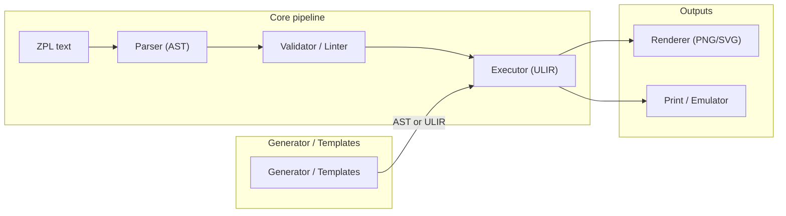
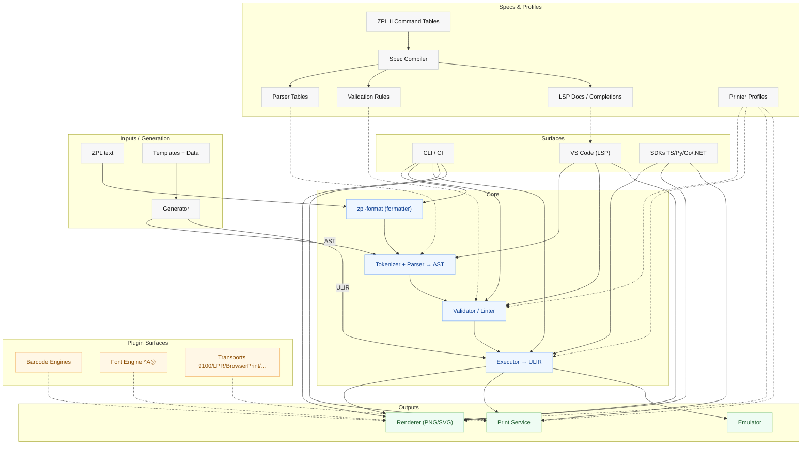
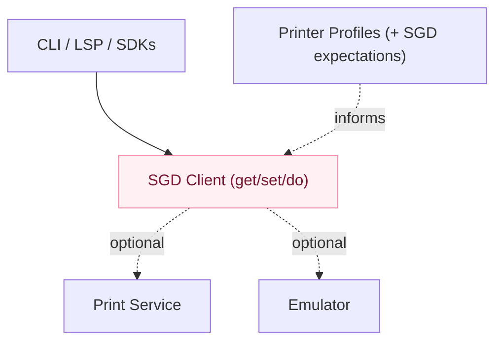

# `@zpl-toolchain` — Spec‑First Architecture & Implementation Plan (v1.3)

> This **complete** v1.3 document supersedes v1.2. It folds in robustness features to cover *all* ZPL II commands while preserving the original structure, goals, and tone. Major additions are marked where relevant but woven into the canonical text.

---

## 0. Executive Summary

Today’s ZPL ecosystem is fragmented: projects often skip a spec‑accurate validator, rely on cloud renderers, or tie themselves to a single runtime. We will build a **single, offline, spec‑first, composable toolchain** with a **Rust** core and **WASM** targets, with bindings for TS / JS, Python, Go, and .NET. The stack centers on two canonical data models — **AST (Abstract Syntax Tree)** and **ULIR (Unified Label Intermediate Representation)** — driven by **machine‑readable ZPL II spec tables** and **printer profiles**. Deliverables include parser, validator / linter, generator, renderer, editor / designer, print client, emulator, CLI, SDKs, and CI‑ready testing.

**PNG is the truth artifact** for behavior. Goldens, visual diffs, and barcode verification keep us honest.

**(optional):** an **SGD management plane**—typed, validated get/set/do of device variables and actions; profile‑declared expected defaults; a **Printer Twin** snapshot + drift check. This **never replaces** ZPL behavior; it complements it for operations.

**v1.3 additions**

- **Planes & scopes**: every command specifies its **plane** (format | host | device) and **scope** (field | document | job | session | device).

- **Lexer/parser mutations:** spec‑driven changes to **command prefix** and **language mode** (e.g., `^CC/~CC`, `^SZ`).

- **First‑class resource references:** `resourceRef` & `composite` arg types for device file paths and fixed extensions (`^XG`, `^A@`, `^DF/^XF`, `~DG`).

- **Profile‑gated enums & combo matrices:** model/firmware‑aware values and cross‑command validity (e.g., `^MM × ^MN × cutter`).

- **Query/response contracts:** typed schemas & parsers for tilde queries (`~HM`, `~HS`, `~HQES`).

- **State models:** deterministic serialization/counters (`^SN`) with ULIR snapshotting.

- **Render contract:** explicit rounding/quantization/pixel rules to guarantee Native/WASM parity.

---

## 0.1 Design Principles

1. **Spec‑compiled, not hand‑coded** — a spec compiler generates parser tables, validators, docs, completions, and quick‑fixes from machine‑readable ZPL tables (**plus** SGD registries). **v1.3:** also emits tokenizer config, resource helpers, combo matrices, query schemas, render contracts.

2. **Micro‑kernel core** — tiny tokenize → **AST** → **ULIR** engine; barcodes, fonts, transports, rulelets are plug‑ins; **SGD is a separate optional plug‑in**.

3. **ULIR (Unified Label Intermediate Representation)** — backend‑agnostic IR; ZPL first, future backends via capability matrix (EPL / TSPL / ESC‑POS / CPCL / PDF).

4. **Determinism over cleverness** — stable formatting / generation; explicit rounding/quantization; heuristics gated by flags.

5. **Fail early, fix fast** — strict checks with actionable auto‑fixes and doc hops.

6. **Portable by default** — defaults target `203‑dpi` portability; profiles can opt into richer behavior.

7. **Zero hidden network** — offline by default; any remote use is opt‑in and replaceable.

8. **Runtime‑agnostic UX** — same mental model across CLI, editor, CI, SDKs.

9. **Small sharp tools** — each sub‑tool is useful solo (parse, `zpl-format`, render, print, emulate) and composes cleanly.

10. **Test the truth** — **PNG** is the truth artifact; goldens + visual diffs + barcode verification. **SGD** uses record/replay fixtures and typed schemas.

**Licensing:** permissive (MIT / Apache‑2.0) across repos.

---

## 1. Goals, Non‑Goals, Versioning

### Goals

- **Spec‑first + offline**, **deterministic** outputs, **high performance** (Rust + WASM), **portable bindings**, **secure by default**, excellent **DX / UX**, and **permissive licensing** (MIT / Apache‑2.0).

- **ZPL** parsing, validation, rendering, generator, editor, print service, emulator, and SDKs with **complete command coverage** (prefix/language mutations, device/media policy, host queries, counters, resource references).

- **Optional SGD**: typed get/set/do, profile defaults, Printer Twin drift detection, CLI/LSP flows, emulator KV‑store — **without changing any ZPL behavior** when unused.

### Non‑Goals (MVP)

- Full WYSIWYG HTML → ZPL in core (later via adapters atop `^GF` encoders).

- Full USB transport coverage day one (start with network + BrowserPrint bridge).

- Full scalable font engine in default WASM (`^A@` optional initially).

- **For SGD:** browser raw sockets; requiring SGD to print; any background/device‑mutating calls by default.

### Versioning & Compatibility

- **Semver** across all packages / crates.

- **ULIR** is versioned; breaking changes bump major with migration notes.

- **Spec tables** are versioned independently; core declares a compatible spec range.

- VS Code extension pins a core/spec range and warns on drift.

- **SGD registries** (variables/actions) are versioned in the spec package with firmware ranges; diffs are surfaced by the spec compiler.

---

## 2. Architecture Overview

### 2.1 **Simple (ZPL data plane)**



**v1.3 note:** The tokenizer consumes **spec‑emitted lexer mutations** (prefix/language) ensuring identical token streams across Native/WASM.

### 2.2 **Comprehensive (ZPL surfaces)**



**v1.3 additions:**

- Compiler also emits **TokenizerConfig**, **resourceRef helpers**, **combo matrices**, **query schemas**, and **RenderContract**.

- Validator enforces **profile‑gated enums** and **combo matrices**.

- Executor implements **state models** (e.g., `^SN`) and embeds effective seeds into ULIR.

### 2.3 **Additive (optional) SGD management plane**



> The SGD graph is separate and optional; it must not interfere with the ZPL pipeline.

---

## 3. Packages (Monorepo)

> **Repository:** `zpl-toolchain` — Rust core, WASM builds, CLI, editor, SDK bindings, transports, and tooling.

### 3.1 Naming & Packaging (by ecosystem)

**Rust (crates.io)**

- `zpl_toolchain_core` (AST / validator / ULIR / renderer)

- `zpl_toolchain_cli`

- `zpl_toolchain_spec`

- `zpl_toolchain_spec_compiler`

- **`zpl_toolchain_sgd` (optional)** — typed SGD client + wire parser + policy

**Node / TypeScript (npm)** — WASM‑backed, thin TS APIs

- `@zpl-toolchain/core`

- `@zpl-toolchain/renderer`

- `@zpl-toolchain/generator`

- `@zpl-toolchain/print` (+ transports)

- `@zpl-toolchain/cli`

- `@zpl-toolchain/editor`

- `@zpl-toolchain/spec`, `@zpl-toolchain/spec-compiler`

- **`@zpl-toolchain/sgd` (optional)** — wrapper for `sgd` APIs

**Python (PyPI)** — `zpl_toolchain` (maturin / pyo3 wheel; **sgd** submodule optional)

**Go (modules)** — `github.com/<org>/zpl-toolchain/go/zpltoolchain` (cgo wrapper; **sgd** pkg optional)

**.NET (NuGet)** — `ZplToolchain` (+ `ZplToolchain.Sgd` optional; RID‑specific native assets via P/Invoke)

> The **core is Rust**, compiled to native libraries and to **WASM**. npm packages wrap the WASM build; Python / Go / .NET bind to the native library. Same engine, many faces.

### 3.2 Targets & Language Bindings (Implementation Intent)

**Single engine, multiple delivery targets**

| Layer / User       | Artifact               | Default Target | Notes                                                                                         |
| ------------------ | ---------------------- | -------------- | --------------------------------------------------------------------------------------------- |
| Rust apps & CLI    | Native library         | **Native**     | Full threads / SIMD via Rayon; best throughput.                                               |
| Python / Go / .NET | Native library via FFI | **Native**     | Wheels / NuGet / modules ship prebuilt binaries; no toolchain required.                       |
| VS Code extension  | WASM module            | **WASM**       | Runs inside extension host safely; no native install.                                         |
| Browser apps       | WASM module            | **WASM**       | Offline‑capable; multiple Web Workers for parallelism.                                        |
| Node services / CI | WASM module (default)  | **WASM**       | Zero native deps; can scale via Worker Threads. Optional native addon later for maximum perf. |

**Determinism guarantee** — Goldens render identically regardless of target or concurrency level; CI compares PNGs across Native / WASM to guard regressions.

> **SGD APIs** follow the same delivery strategy as optional modules; enabling them does **not** change ZPL runtime behavior.

### 3.3 Authoring format

- The registry is authored as **JSONC** and validated by the compiler after comment-stripping.

- Canonical filename: `zpl-spec.schema.jsonc` (schema) and `*.jsonc` (command tables).

- The compiler treats `x-*` properties as **opaque**, forwarding them to LSP/docs where useful.

---

## 4. Components

### 4.0 `@zpl-toolchain/spec-compiler`

Build‑time generator that ingests `@zpl-toolchain/spec` tables and emits:

- tokenizer / grammar constants, arg parsers, validator rules / messages,

- LSP artifacts (hover docs, signature help, completions, code actions),

- Reference docs.

**v1.3 additional outputs:**

- **TokenizerConfig** (prefix/language mutations per spec).

- **Signature builder**: renders canonical **Format:** from `signature` (`codes[0]` + join rules), honors `noSpaceAfterOpcode`/`allowEmptyTrailing`, and merges any `signatureOverrides` per-opcode.

- **resourceRef** & **composite** arg helpers (printer‑device paths, fixed extensions, name rules).

- **comboMatrix** + **profile‑gated enums** for validator tables.

- **Query/Response** schemas & sample parsers for tilde commands (`~HM`, `~HS`, `~HQES`).

- **RenderContract** constants consumed by all renderer targets.

#### 4.0a Spec‑compiler codegen enhancements

- **Typed bindings**: discriminated unions for Rust/TS; generated JSON Schemas for configs and CLI I/O.

- **Executable examples**: spec entries embed runnable examples; compiler emits unit tests and VS Code hover snippets tied to those examples.

- **Failure gates**: docs fail CI if examples are broken; tables must hit coverage thresholds.

#### 4.0b Schema v1.1.0 (codes/signature/composites)

- **`codes` (new):** replace `code`/`aliases` with `codes: string[]`; **`codes[0]` is canonical**.  
  Back-compat: if `code` exists, the compiler **normalizes** to `codes: [code, ...aliases]`.

- **`signature` (new):** defines the wire **Format:** deterministically:
  
  - `params: string[]` (each item is an `args[*].key` or a `composites[*].name`)
  
  - `joiner: string` (default `,`)
  
  - `noSpaceAfterOpcode: boolean` (default `true`)
  
  - `allowEmptyTrailing: boolean` (default `false`)

- **`signatureOverrides` (new/rare):** allow caret/tilde twins to diverge **without forking** a command entry. Keys are opcode variants (e.g., `"^"`, `"~"`), values are full `signature` blocks.

- **`composites` (new):** reusable path-like segments (e.g., `{d}:{o}.{x}` for `^XG`, `{d}:{f}.{x}` for `^A@`).  
  Each composite declares `name`, `template`, and `exposesArgs` (the arg keys that appear inside the template).

- **No functional change to `args[]`:** `signature.params[*]` simply references `args[*].key` **or** a `composites[*].name`.

#### 4.0c Emitter & Validator changes (schema v1.1.0)

- **Normalization:** if `code` is present, synthesize `codes` and drop `aliases` internally.

- **Format builder:** render **Format:** as `codes[0]` + (`noSpaceAfterOpcode ? \"\" : \" \"`) + `params.join(joiner)`; honor `allowEmptyTrailing`.

- **Composites expansion (docs/LSP):** when a `signature.params[i]` names a composite, expand its `template` for **docs**; for **validation**, ensure every `exposesArgs` key exists and appears **exactly once** across `signature`+`composites`.

- **LSP UX:** show `codes[0]` as the header and “Also available as …” for the remaining `codes`. If a `signatureOverride` exists, surface **per-opcode** hovers/signatures.

- **Authoring checks:**
  
  - Every `signature.params[*]` must match an existing `args.key` **or** a `composites.name`.
  
  - **Warn** if an `args.key` is never referenced by `signature` (likely an authoring error).

### 4.1 `@zpl-toolchain/grammar`

Rust tokenizer + parser (Logos / combinators). Comments/whitespace/raw regions. Emits **typed AST** with spans. **SGD is not parsed here.** **v1.3:** Tokenizer obeys spec‑emitted **prefix/language mutations** and serializes the effective mode into AST metadata for LSP banners.

### 4.2 `@zpl-toolchain/spec`

Versioned **ZPL** command & constraint tables (+ docs) as JSON / TOML. CI asserts schema and implementation **coverage**.

**v1.3 schema facets:** `plane`, `scope`, `lexerMutation`, `args[type=resourceRef|composite]`, `enumWhen`, `comboMatrix`, `response`, `stateModel`, `renderContract`, `defaultsMap`, `safety`, `gates`.

**(optional) registries:** `sgd.variables[]`, `sgd.actions[]` with firmware gates.

- Add: “**schema v1.1.0:** replaces `code`/`aliases` with `codes`, introduces `signature`/`signatureOverrides`, and adds `composites`.”

### 4.3 `@zpl-toolchain/core` (validator + ULIR executor)

- Validation: presence/order, arity, types, ranges, unit conversions.

- Cross‑command / state coupling (e.g., `^FW` vs field rotation; `^FB` effects; `^BY` defaults for `^BC` / `^BD` / `^BE`; `^GF` storage rules).

- **ULIR** executor: units / DPI scaling, `^FW`, `^FB`, `^FO` / `^FT` precedence, darkness / speed hints.

- Lint tiers: **error / warn / advisory**. Custom rules via config + sandboxed **WASM rulelets**.

**v1.3 additions:**

- **State models** for serialization/counters (`^SN`) with deterministic ULIR embedding.

- **Combo‑matrix** enforcement and **profile‑gated enum** resolution.

- New diagnostics: `prefix-changed-next-char` (info), `language-mode-changed` (info), `combo-invalid` (error), `rounding-applied` (info), `serialization-seed-missing` (warn).

**Real‑world notes:**

- **Fonts & code pages:** Ship device‑font metric packs per printer family (A..H/0 vary). Handle `^CI` code pages and provide a sanitizer for characters not representable under the active `^CI`.

- **`^A@` downloadable fonts:** Optional in WASM; prioritize native support early for labs needing Greek/non‑Latin or long IDs.

- **Barcode layout knobs:** Configurable quiet‑zone enforcement and module‑width rounding strategies per symbology and DPI.

#### 4.3a ULIR normalization & renderer contracts

- **Normalization passes:** deterministic unit normalization, layout resolution, barcode parameter canonicalization before rendering.

- **Structural hashing:** BLAKE3 of ULIR and rendered PNGs to dedupe caches/artifacts.

- **Pixel‑law contract:** documented rounding rules, module quantization, and anti‑alias policy identical in native & WASM.

### 4.4 (optional) `@zpl-toolchain/sgd`

Typed client to **get/set/do**; transport‑agnostic; policy & redaction; record/replay fixtures.

#### 4.4a SGD Transaction Model

- **Plan‑first:** `snapshot → diff(profile) → plan`; supports `--dry-run` and JSON output for CI.

- **Staged writes:** dependency‑ordered sets; verify with post‑`get`; rollback where possible.

- **Idempotency keys:** dedupe retries on flaky links.

- **Session scope:** optional auto‑restore of volatile changes after a print job.

### 4.5 `@zpl-toolchain/generator`

- Programmatic label builder: produce **AST** or **ULIR** → ZPL.

- **Schema‑checked templating** (JSON Schema / Zod); conditionals/loops; deterministic transforms (date, checksum, case).

- Layout helpers: grid / guides, baseline alignment, fit‑to‑PW / LL, multi‑DPI strategies, optical safe areas.

- Style presets: tubes / cryovials / plates / equipment.

- **Label ABI**: versioned template metadata (inputs, constraints, profile assumptions).

### 4.6 `@zpl-toolchain/editor`

- **VS Code extension** (LSP): semantic tokens, hovers, diagnostics + quick‑fixes, refactors, **live preview** (WASM), printer profile switcher, grids / safe areas.

- **Designer canvas**: IR‑layer editor; round‑trip to ZPL via generator; split view (code ↔ canvas).

- Snippets/code actions: `^XA` / `^XZ` scaffolds, `^FB` blocks, barcode wizards.

- Print commands, job history, artifact diffs (image & ZPL).

**Resource & media management:**

- **On‑device resources:** Resource Manager to sync/list/delete/checksum graphics/fonts (ZPL “file system”). Preflight fails if a referenced `R:*.GRF`/`E:*` is missing. Support `^DG`/`^DB`/`^DY` lifecycle and `^XG` placement.

- **Media policy checks:** Validate `^MN/^MT/^MM`, peel/cut/tear‑off combinations, `^PR` speed and `^MD` darkness against profile. Ensure `^LL` bounds, non‑zero top origin where required.

- **Batching & multi‑label:** Distinguish job vs page (e.g., `^PQ`). Provide `spooler.split()` for throughput. Implement deterministic chunking for large `^GF` blocks to avoid device buffer issues.

**Preflight & Twin:**

- **`preflight` subcommand:** `zpl preflight <label>` computes effective `^PW/^LL`, object bounds, text overflow, barcode quiet zones, total `^GF` bytes, media mode sanity, and returns pass/fail.

- **Printer Twin ops:** `zpl twin pull|push` to version device state (profiles; optional SGD snapshot).

### 4.9 SDKs — `@zpl-toolchain/sdk-{ts,py,go,dotnet}`

Thin bindings over the core; uniform APIs; **optional** `sgd.*` namespaces.

### Job vs page model

ULIR introduces a **Job** container including one or more **Pages**. This reflects ZPL constructs like `^PQ` within a single `^XA…^XZ` block and enables batching/splitting logic in the spooler.

### Deployment notes

- **Device storage:** Profiles capture storage letters (`R:`,`E:`,`B:`), capacities, and per‑model limits for graphics/font resources.

- **Provenance:** Embed firmware ranges and font‑metric origin; publish a profile fingerprint.

- **Self‑check:** Optional live validation using `~HQES/~HS` to compare a real printer’s snapshot with the profile and warn on drift.

### 4.10 Profiles — Capability Matrix & Verification Kit

- **Capability matrix:** declare ZPL command coverage, barcode constraints, and SGD vars/actions per profile (with firmware gates).

- **Downgrade hints:** validators propose safe alternatives when commands are unsupported.

- **Probe kit:** `probe run` sends `~HS/^HH` and tiny labels to auto‑fill capabilities; results can be signed and merged into profiles.

---

## 7. Configuration

### 7.1 Resolution & Precedence

Order of precedence (highest wins): CLI flags → env vars → nearest project `.zplrc.jsonc` → user config → embedded template metadata → built‑ins. `zpl config --show` prints effective config and source per key.

**Common env vars (preserved):** `ZPL_PROFILE`, `ZPL_DPI`, `ZPL_RENDER_DITHER`, `ZPL_LINT_STRICT=1`, `ZPL_CACHE_DIR`, `ZPL_RULELETS_DIR`, `ZPL_OFFLINE=1`.

**v1.3 additions:**

- `ZPL_TOLERANT_UNKNOWNS=1` (treat unknown codes as info with suggestions).

- `ZPL_ALLOW_DANGEROUS=1` (gate execution of commands marked `safety.class>=medium`).

### 7.2 File Conventions

- Ignore: `.zplignore` (gitignore syntax) for `zpl render --golden` and `zpl lint` discovery.

- Templates: `.zplt` (ZPL + placeholders) + optional adjacent `.schema.json`.

- Profiles: JSON files under `profiles/`, referenced by id in `.zplrc.jsonc`.

### 7.3 `.zplrc.jsonc` (full example)

```jsonc
{
  "$schema": "https://zpl.dev/schema/zplrc.json",
  "printerProfile": "zebra-zd620-203dpi",
  "units": "mm",
  "dpiStrategy": "portable-203",
  "paths": {
    "profiles": "./profiles",
    "rulelets": "./zpl-rulelets",
    "goldens": "./test/goldens",
    "cache": ".zpl-cache"
  },
  "template": {
    "delimiters": ["${", "}"],
    "schema": "./schemas/tube-label.schema.json",
    "strict": true,
    "coerce": true,
    "transforms": { "date": "yyyy-MM-dd", "uppercase": ["sampleId"] }
  },
  "lint": {
    "mode": "strict",
    "error": ["missing-terminator-xz","arg-out-of-range","unknown-command","barcode-quiet-zone-too-small"],
    "warn": ["no-explicit-pw-ll","text-overflow-in-fb","image-not-multiple-of-8"],
    "advice": ["merge-repeated-fields","prefer-mm-units"],
    "rules": { "max-darkness": 25, "min-font-height-mm": 1.7, "require-origin-command": true, "portable-dpi": true },
    "rulelets": [{ "id": "org.policy.example", "path": "zpl-rulelets/policy.wasm", "allow": ["readSpec"] }]
  },
  "render": {
    "output": "png",
    "dpi": 203,
    "antialias": true,
    "dither": "floyd-steinberg",
    "background": "transparent",
    "trim": true,
    "barcode": {
      "verify": true,
      "defaultStandard": "none",
      "standards": {
        "GS1": { "enabled": true, "aiAllowlist": ["01","10","17"], "enforceFNC1": true },
        "HIBC": { "enabled": true, "linkCharacter": "auto" }
      }
    }
  },
  "print": {
    "transport": "tcp9100",
    "target": { "host": "192.168.1.55", "port": 9100 },
    "retries": 3,
    "backoffMs": 1000,
    "preflight": { "policy": "fail", "autoScaleMaxPct": 5 },
    "statusTimeoutMs": 1500,
    "queue": { "enabled": true, "maxPending": 100 }
  },
  "emulator": {
    "enabled": false,
    "port": 9100,
    "profile": "zebra-zd621-203dpi",
    "faults": { "paperOut": false, "headOpen": false },
    "memoryLimitKb": 4096,
    "recordJobs": true,
    "artifactDir": ".zpl-emulator"
  },
  "security": { "offline": true, "redactLogs": true, "logLevel": "info" },
  "policy": { "tolerantUnknowns": false, "allowDangerous": false }
}
```

### 7.3a `.zplrc.jsonc` — **optional** SGD section

```jsonc
{
  "sgd": {
    "allowWrites": false,
    "allowlist": ["device.languages","ip.*","odometer.*"],
    "denylist": ["*password*","wlan.passphrase","tls.*"],
    "timeoutMs": 1500,
    "retries": 2,
    "backoffMs": 400,
    "dangerousRequireFlag": true,
    "snapshot": { "include": ["device.languages","media.*","print.*"] }
  }
}
```

### 7.4 CLI Flag Mapping (common)

`--profile`, `--dpi`, `--units`, `--dither`, `--verify-barcodes`, `--preflight`, `--transport`, `--host`, `--port`, `--retries`, `--strict`, `--fix`, `--check`, `--golden-dir`, `--rulelet <path>`.

**SGD CLI (optional):** `zpl sgd get|set|do|snapshot|diff|apply` with `--yes`, `--allow-risky`, `--dry-run`.

### 7.5 Rulelets (Sandboxed Lint Extensions)

- **Format**: WASM modules receiving `{ast, profile, spec, config}` and returning diagnostics/quick‑fixes.

- **Sandbox**: no network / FS; deterministic clock; CPU / mem / time caps; allowed host fns are whitelisted (e.g., `readSpec()`).

- **Packaging**: `.wasm` + `rule.json` manifest (id, version, description, permissions).

- **Distribution**: checked into repo or installed via private registry; enterprises can enforce an allowlist.

#### 7.5a Rulelets v2 ABI

- **Versioned ABI** with declarative capabilities (`readSpec`, `readProfile`), deterministic quotas, and a tiny SDK.

- **Policy:** enterprise allowlist maps capabilities; CI runs rulelets under quota to prevent nondeterminism.

### 7.6a Security & template determinism

- **Logging:** Redact label payloads by default; opt‑in verbose modes never dump full ZPL.

- **Template runtime:** Deterministic clock by default, no network transforms, and explicit **input size limits**.

- **Media policy:** Configurable checks for `^MN/^MT/^MM`, `^PR`, `^MD`, and `^LL` bounds with `fail|warn|off` modes.

### 7.7 Golden Tests & Verify

- `zpl render --golden` compares PNG fixtures in `paths.goldens`.

- `zpl verify --barcode` decodes barcodes from rendered PNGs; enforces quiet zones and (if enabled) selected standard payload rules.

- **v1.3:** Adds **lexer mutation**, **combo matrix**, **query parse**, **serialization determinism**, and **render‑contract** parity test suites.

### 7.8 Template ABI Metadata (example)

```jsonc
{
  "abiVersion": 1,
  "id": "tube.v1",
  "profile": "zebra-zd620-203dpi",
  "inputs": {
    "sampleId": { "type": "string", "required": true },
    "lot": { "type": "string" },
    "expires": { "type": "string", "format": "date" }
  },
  "constraints": [
    { "kind": "barcodeStandard", "symbology": "DataMatrix", "standard": "GS1", "required": false }
  ],
  "preview": { "width_mm": 25, "height_mm": 19 }
}
```

---

## 8. Public API Sketches

*(unchanged; representative snippets preserved)*

```ts
import { parse, validate } from "@zpl-toolchain/core";
import { renderPNG } from "@zpl-toolchain/renderer";
import { Printer, Emulator } from "@zpl-toolchain/print";
```

```python
import zpl_toolchain as zpl
```

```go
import zpl "github.com/<org>/zpl-toolchain/go/zpltoolchain"
```

```csharp
using ZplToolchain;
```

```ts
const ast = parse(zplText);
const result = validate(ast, { profile: "zebra-zd420-300dpi" });
if (!result.ok) console.error(result.issues);
```

```ts
import { compileTemplate } from "@zpl-toolchain/generator";
const tpl = compileTemplate(readFile("tube-label.zplt"), { schema: "tube.schema.json" });
const { zpl, ir } = tpl.render({ sampleId: "ABC123", lot: "L-42" });
```

```ts
const png = await renderPNG(ir, { dpi: 203 });
await fs.writeFile("preview.png", png);
```

```ts
const emu = new Emulator({ port: 9100, profile: "zebra-zd621-203dpi" });
emu.start();
const p = await Printer.connect({ host: "127.0.0.1", port: 9100 });
await p.print(zpl);
const status = await p.status();
```

*(Optional) SGD*

```ts
import { sgd } from "@zpl-toolchain/sgd";
const snap = await sgd.snapshot({ include: ["device.languages","media.*"] });
const diff = sgd.diff(snap, profileExpected);
await sgd.setVar("device.languages", "zpl", { allowRisky: false });
```

---

## 9. High‑Throughput Mode (Batch & Concurrency)

*(unchanged; adds enforcement of combo matrices during preflight and rendering quantization from render contract)*

---

## 11. VS Code Extension (MVP)

- Syntax + **semantic** highlighting; hovers from spec tables.

- Diagnostics with **quick‑fixes** (insert `^XZ`, add `^PW` / `^LL`, fix barcode module width/ratios).

- Live preview (WASM) with DPI / profile toggles, grids, safe areas.

- **Designer**: drag / drop primitives; round‑trip via generator; split view (code ↔ canvas).

- Templates: placeholder definitions + **Data Preview** panel (sample JSON).

- **Preflight wizard**; **visual diffs**; print commands & job console.

- Config UI; Rulelets manager; **Printer Twin** import/export.

**v1.3:** shows **plane/scope chips**, **mode banners** (prefix/language flips), resourceRef search‑order hovers, and **combo‑matrix** quick‑fix suggestions.

---

## 12. Print Service & Emulator (Ops‑grade)

*(unchanged capabilities; v1.3 adds typed query responses & combo‑matrix preflight enforcement)*

---

## 13. Security & Telemetry

*(unchanged; logs respect redaction; queries are parsed with schemas and never raw‑logged)*

---

## 14. Phased Delivery Plan

*(as in v1.2 with v1.3 mid‑phase items noted earlier: tokenizer mutations, render contract, combo matrices, query schemas, state models)*

---

## 15. Testing Strategy

- **Golden corpus** PNG diffs in CI (sharded & parallel).

- **Differential** vs devices (where feasible) and known engines (license permitting).

- **Fuzzing**: grammar fuzz + property tests (no panics, bounded memory/time).

- **Barcode verification**: decode rendered bitmaps; validate against selected standard(s) and quiet zones.

- **Performance gates**: render time/memory budgets; incremental parse/validate in editor.

- **Round‑trip**: `format(parse(zpl)) == zpl` under normalization.

- **ULIR** fixtures: parity across WASM/native.

- **Profile conformance**: per‑profile snapshots for `^PW` / `^LL` and font metrics.

**v1.3 expansions**

- Lexer‑mutation goldens (prefix/language change mid‑stream).

- Combo‑matrix suites per profile.

- Query parse goldens for `~HM`, `~HS`, `~HQES`.

- Serialization determinism (`^SN`) across preview/emulator/print.

- RenderContract parity (pixel rounding, module quantization, byte alignment) across targets.

---

## 16. Risks & Mitigations

- **Spec drift** → Separate spec package, PR review, coverage report, behavioral‑changes log.

- **WASM memory ceilings** → Chunked / streaming pipelines; documented complexity guidance.

- **Font metric mismatches** → Device‑font test suite; `^A@` optional in WASM; native harfbuzz feature.

- **Barcode edge cases** → Verify mode; strict lint rules; team‑specific rulelets.

- **USB complexity** → Prioritize network; add USB transports later per‑platform.

- **Rulelet sandboxing** → No network / FS, deterministic clock, CPU / memory guards; enterprise allowlists.

- **SVG fidelity** → Strict policy; outline text only on request; warn on non‑orthogonal image transforms.

**v1.3‑specific:**

- **Mode churn** → TokenizerConfig is content‑addressed; LSP mode banners reduce confusion.

- **Model‑dependent combos** → Enforced by combo matrices; downgrade hints in diagnostics.

**SGD‑specific:** dangerous ops require explicit flags; default read‑only; transport interleaving avoided; retries with jitter; secrets redacted; audit events for set/do.

---

## 17. MVP Definition

- **Core**: micro‑kernel, **Spec Compiler**, validator, renderer (PNG), `zplfmt`, CLI, WASM build.

- **Commands**: `^XA`/`^XZ`, `^PW`/`^LL`/`^LH`, `^FO`/`^FT`, `^FB`, `^FW`, `^A` (device fonts), `^BY`, `^BC`, `^BQN`, `^BX`, `^GB`, `^GF` (decode+encode).

- **Profiles**: ZD420 / ZD421 / ZD620 / ZD621 @ `203` & `300` dpi (portable‑203 strategy).

- **Editor**: LSP diagnostics + hovers + live preview; minimal designer; quick‑fixes; preflight.

- **Print**: TCP 9100 + emulator (job capture, faults) + Printer Twin.

---

## 18. Open Questions (pre‑Phase 2)

- **Barcode engine choice**: Which Rust crates meet compliance? Which symbologies need Zint fallback initially?

- **SVG text fidelity**: Criteria for outline vs. device font mapping in SVG.

- **Template rulelets API**: Minimal sandbox surface (I/O restrictions, caps).

- **Profile authoring**: Crowd‑source / verify profiles safely? Sign / verify process?

- **ULIR stability**: Versioning policy and guarantees for editor / generator / renderer integrations.

**Open Questions (SGD)**

- Minimal high‑value variable/action subset per model for MVP.

- Session apply/restore semantics after temporary changes.

- Browser transport bridge choice (BrowserPrint vs local helper) and packaging.

- Typed coercion rules for ints/floats/bools (canonical formatting) to avoid vendor quirks.

---

## 19. Appendix A — Command Registry Schema (sketch)

*(v1.3 adds fields but keeps the spirit; see Spec Compiler doc for full schema)*

```jsonc
{
  // ──────────────────────────────────────────────────────────────────────────────
  // Schema metadata
  // ──────────────────────────────────────────────────────────────────────────────
  "$schema": "https://json-schema.org/draft/2020-12/schema",
  "$id": "https://zpltoolchain.com/schema/zpl-spec.schema.jsonc",
  "title": "ZPL Command Registry (commented JSONC)",
  // NOTE: This file is JSONC; the spec-compiler strips comments before validation.

  "type": "object",
  "properties": {
    // Content version of this registry (not the schema version)
    "version": { "type": "string", "description": "Semver of this spec data set" },

    // Schema version bump for the new signature/codes/composites + effects/doc/minLength/maxLength
    "schemaVersion": { "type": "string", "const": "1.1.1" },

    // Optional extra metadata for docs/provenance
    "meta": { "type": "object", "additionalProperties": true },

    // The full list of ZPL/host commands
    "commands": {
      "type": "array",
      "description": "All ZPL/host commands in this registry",
      "items": { "$ref": "#/$defs/command" }
    }
  },
  "required": ["commands", "schemaVersion"],
  "additionalProperties": false,

  // Allow vendor/experimental fields anywhere
  "patternProperties": { "^x-": {} },

  "$defs": {
    // ────────────────────────────────────────────────────────────────────────────
    // Signature & composites (since 1.1.0)
    // ────────────────────────────────────────────────────────────────────────────
    "signature": {
      "type": "object",
      "properties": {
        // Ordered short keys or composite names that appear after the opcode
        // Example: ["a","b","c"] for ^JJa,b,c  — or ["d:o.x","mx","my"] for ^XG
        "params": {
          "type": "array",
          "items": { "type": "string", "minLength": 1 },
          "minItems": 0
        },
        // How params are joined (ZPL default is ",")
        "joiner": { "type": "string", "default": "," },
        // ZPL format has no space after opcode (keep true for correctness)
        "noSpaceAfterOpcode": { "type": "boolean", "default": true },
        // If true, allow trailing empty params to preserve position (common in ZPL)
        "allowEmptyTrailing": { "type": "boolean", "default": true }
      },
      "required": ["params"],
      "additionalProperties": false
    },

    "composite": {
      "type": "object",
      "properties": {
        // Name used inside signature.params, e.g., "d:o.x"
        "name": { "type": "string", "minLength": 1 },
        // Template that references underlying args by key, e.g., "{d}:{o}.{x}"
        "template": { "type": "string", "minLength": 1 },
        // Which args (by key) are composed here (helps docs & validation)
        "exposesArgs": {
          "type": "array",
          "items": { "type": "string", "minLength": 1 },
          "minItems": 1
        },
        "doc": { "type": "string" }
      },
      "required": ["name", "template", "exposesArgs"],
      "additionalProperties": false
    },

    // ────────────────────────────────────────────────────────────────────────────
    // Command
    // ────────────────────────────────────────────────────────────────────────────
    "command": {
      "type": "object",
      "properties": {
        // NEW: list of opcodes that invoke this logical command (first = canonical)
        "codes": {
          "type": "array",
          "items": { "type": "string", "pattern": "^[\\^~][A-Z0-9]{1,3}$" },
          "minItems": 1
        },

        // BACK-COMPAT (deprecated): single code + aliases
        // If present, the compiler will normalize to `codes: [code, ...aliases]`.
        "code": { "type": "string", "pattern": "^[\\^~][A-Z0-9]{1,3}$" },
        "aliases": {
          "type": "array",
          "items": { "type": "string", "pattern": "^[\\^~][A-Z0-9]{1,3}$" }
        },

        "name": { "type": "string" },
        "category": { "type": "string" },                 // text, barcode, graphics, media, format, device
        "plane": {
          "enum": ["format", "device", "host"],
          "description": "format (label content), device (settings), or host (status)"
        },
        "scope": {
          "enum": ["document", "field", "job", "session"],
          "default": "field",
          "description": "Effect lifetime; e.g., field-scoped like ^A, or document (^PW)"
        },

        // UPDATED: accept either simple tags or a structured object with state hints
        "effects": {
          "oneOf": [
            { "type": "array", "items": { "type": "string" } },
            {
              "type": "object",
              "properties": {
                "state": { "type": "array", "items": { "type": "string" } }
              },
              "additionalProperties": true
            }
          ],
          "description": "Either tag array or structured side-effect hints"
        },

        "since": { "type": "string" },
        "deprecated": { "type": "boolean", "default": false },
        "deprecatedSince": { "type": "string" },
        "stability": { "enum": ["stable", "experimental", "deprecated"], "default": "stable" },

        // Arguments in Zebra's positional order
        "arity": { "type": "integer", "minimum": 0 },
        "args": {
          "type": "array",
          "items": { "$ref": "#/$defs/argUnion" },
          "description": "Positional arguments in Zebra’s published order"
        },

        // Command-level defaults (freeform bag; compiler understands common patterns)
        "defaults": { "type": "object", "additionalProperties": true },

        // Command-level unit context; args may override
        "units": { "type": "string" },

        // Validation/lint constraints
        "constraints": { "type": "array", "items": { "$ref": "#/$defs/constraint" } },

        // Capability gates matched by printer profiles
        "printerGates": { "type": "array", "items": { "type": "string" } },

        // Executable/doc examples
        "examples": { "type": "array", "items": { "$ref": "#/$defs/example" } },

        "docs": { "type": "string" },
        "extras": { "type": "object", "additionalProperties": true },

        // NEW: canonical parameterization for building the "Format:" string
        "signature": { "$ref": "#/$defs/signature" },

        // NEW: per-opcode overrides when twins differ slightly (rare)
        "signatureOverrides": {
          "type": "object",
          "additionalProperties": { "$ref": "#/$defs/signature" }
        },

        // NEW: path-like composites (e.g., d:o.x for ^XG, or d:f.x for ^A@)
        "composites": { "type": "array", "items": { "$ref": "#/$defs/composite" } }
      },

      // At least one of {codes} or {code} must be provided
      "anyOf": [
        { "required": ["codes"] },
        { "required": ["code"] }
      ],

      // Keep existing requirement for arity
      "required": ["arity"],
      "additionalProperties": false
    },

    // ────────────────────────────────────────────────────────────────────────────
    // Arg or Union of Args
    // ────────────────────────────────────────────────────────────────────────────
    "argUnion": {
      "description": "Either a single arg or a union of mutually exclusive arg shapes",
      "oneOf": [
        { "$ref": "#/$defs/arg" },
        {
          "type": "object",
          "properties": {
            "oneOf": {
              "type": "array",
              "minItems": 2,
              "items": { "$ref": "#/$defs/arg" }
            }
          },
          "required": ["oneOf"],
          "additionalProperties": false
        }
      ]
    },

    // ────────────────────────────────────────────────────────────────────────────
    // Arg
    // ────────────────────────────────────────────────────────────────────────────
    "arg": {
      "type": "object",
      "properties": {
        "name": { "type": "string" },                     // Long name (e.g., "height")
        "key": { "type": "string" },                      // Short positional key (e.g., "h")

        // Primitive type
        "type": { "enum": ["int", "float", "enum", "bool", "string", "resourceRef", "char"] },

        // Unit/range for numeric args
        "unit": { "type": "string" },
        "range": {
          "type": "array",
          "minItems": 2,
          "maxItems": 2,
          "items": { "type": "number" }
        },

        // String-arg constraints (NEW)
        "minLength": { "type": "integer", "minimum": 0 },
        "maxLength": { "type": "integer", "minimum": 0 },

        // Inline arg help text (NEW)
        "doc": { "type": "string" },

        // Enum values can be strings or objects with per-value gates
        "enum": {
          "type": "array",
          "items": {
            "oneOf": [
              { "type": "string" },
              {
                "type": "object",
                "properties": {
                  "value": { "type": "string" },
                  "printerGates": { "type": "array", "items": { "type": "string" } },
                  "extras": { "type": "object", "additionalProperties": true }
                },
                "required": ["value"],
                "additionalProperties": false
              }
            ]
          }
        },

        // Presence semantics (tri-state-ish)
        "optional": { "type": "boolean", "default": false },
        "presence": {
          "enum": ["unset", "empty", "value", "valueOrDefault", "emptyMeansUseDefault"],
          "description": "Clarifies how empty args are interpreted by firmware"
        },

        // Defaults: literal or dependency-based
        "default": {},
        "defaultFrom": { "type": "string", "description": "Dependency command or state (e.g., ^FW, ^CF)" },

        // Conditional numeric rules (handled by validator)
        "rangeWhen": { "type": "array", "items": { "$ref": "#/$defs/conditionalRange" } },

        // Rounding policy (global or conditional)
        "roundingPolicy": { "$ref": "#/$defs/roundingPolicy" },
        "roundingPolicyWhen": { "type": "array", "items": { "$ref": "#/$defs/conditionalRounding" } },

        // Resource ref specialization
        "resource": { "enum": ["graphic", "font", "any"] },

        // Extra gates & metadata
        "printerGates": { "type": "array", "items": { "type": "string" } },
        "extras": { "type": "object", "additionalProperties": true }
      },
      "required": ["name", "type"],
      "additionalProperties": false
    },

    // ────────────────────────────────────────────────────────────────────────────
    // Conditional range / rounding
    // ────────────────────────────────────────────────────────────────────────────
    "conditionalRange": {
      "type": "object",
      "properties": {
        "when": { "type": "string", "description": "DSL predicate label (e.g., 'fontIsBitmap')" },
        "range": {
          "type": "array",
          "minItems": 2,
          "maxItems": 2,
          "items": { "type": "number" }
        }
      },
      "required": ["when", "range"],
      "additionalProperties": false
    },

    "roundingPolicy": {
      "type": "object",
      "properties": {
        "unit": { "type": "string" },
        "mode": {
          "enum": [
            "nearest",
            "floor",
            "ceil",
            "ties-to-even",
            "toMultiple",
            "toNearestMultipleOfBaseHeight",
            "toNearestMultipleOfBaseWidth"
          ]
        },
        "multiple": { "type": "number" }
      },
      "required": ["mode"],
      "additionalProperties": false
    },

    "conditionalRounding": {
      "type": "object",
      "properties": {
        "when": { "type": "string" },
        "mode": { "type": "string" },
        "multiple": { "type": "number" }
      },
      "required": ["when", "mode"],
      "additionalProperties": false
    },

    // ────────────────────────────────────────────────────────────────────────────
    // Constraint (validation/lint)
    // ────────────────────────────────────────────────────────────────────────────
    "constraint": {
      "type": "object",
      "properties": {
        "kind": { "enum": ["order", "incompatible", "requires", "range", "note", "custom"] },
        "expr": { "type": "string", "description": "Small DSL condition; optional for kind=note/custom" },
        "message": { "type": "string" },
        "severity": { "enum": ["error", "warn", "info"], "default": "warn" },

        // For sandboxed WASM rulelets
        "wasmRuleletId": { "type": "string" },

        "extras": { "type": "object", "additionalProperties": true }
      },
      "required": ["kind", "message"],
      "additionalProperties": false
    },

    // ────────────────────────────────────────────────────────────────────────────
    // Example (docs + tests + snippets)
    // ────────────────────────────────────────────────────────────────────────────
    "example": {
      "type": "object",
      "properties": {
        "title": { "type": "string" },
        "zpl": { "type": "string" },
        "pngHash": { "type": "string", "description": "Optional BLAKE3 of rendered PNG" },
        "notes": { "type": "string" },
        "since": { "type": "string" },
        "profiles": { "type": "array", "items": { "type": "string" } }
      },
      "required": ["zpl"],
      "additionalProperties": false
    }
  }
}
```

---

## 20. Appendix B — ULIR Types (sketch)

```ts
export type IR = {
  page: { width_mm: number; height_mm: number; dpi: number };
  objects: IRObject[];
};

export type IRObject =
  | { kind: "text"; x_mm: number; y_mm: number; rotation: 0|90|180|270; font: DeviceFont; height_mm: number; text: string }
  | { kind: "barcode"; x_mm: number; y_mm: number; rotation: 0|90|180|270; symbology: Symb; params: Record<string, number|string|boolean>; data: string }
  | { kind: "line"; x1_mm: number; y1_mm: number; x2_mm: number; y2_mm: number; thickness_mm: number }
  | { kind: "rect"; x_mm: number; y_mm: number; w_mm: number; h_mm: number; radius_mm?: number; stroke_mm?: number; fill?: boolean }
  | { kind: "bitmap"; x_mm: number; y_mm: number; w_px: number; h_px: number; data: Uint8Array };
```

---

## 21. Open‑Source Survey → Design Mapping — preserved

- **zebrash / zpl‑renderer‑js / zpl‑js** → Offline rendering & editor UX are feasible; we add **formal validation**, **profiles**, and **spec tables**.

- **lprint / zpl‑print** → Discovery / spooling ideas; we keep a thin ZPL‑first client + integrated emulator.

- **PDF / Image → ZPL** → Adapter on top of our `^GF` encoder.

- **Editors / Designers** → Fold into VS Code + small web designer sharing **AST / ULIR / generator**.

- **VS Code labelary preview** → Replace with **WASM renderer** + profiles.

---

## 22. Suggested Repo Layout

```
zpl-toolchain/
  crates/
    core/                 # Rust: AST, validator, ULIR, renderer
    spec/                 # ZPL spec tables (JSON/TOML)
    spec-compiler/        # Generates validators, LSP artifacts, docs
    cli/                  # Rust CLI (zpl, zpl-format)
    sgd/                  # optional crate for SGD client & policy
  bindings/
    node/                 # WASM build + npm packages (@zpl-toolchain/*)
    python/               # maturin/pyo3 wheel (zpl_toolchain)
    dotnet/               # NuGet packaging, P/Invoke glue
    go/                   # cgo wrapper
  packages/               # TS utilities (editor, transports, etc.)
    sgd/                  # optional @zpl-toolchain/sgd
  tools/                  # release & build scripts
```

---

## 23. Checklist / Next Actions

- Finalize Rust MSRV & CI matrix (Linux / macOS / Windows; Node+browser WASM).

- Lock spec table schema; implement **Spec Compiler** scaffolding.

- Implement tokenizer / parser → **AST** with spans & comments.

- Implement validator passes (arity / type / range / unit; key cross‑checks).

- Define **ULIR** v0; implement minimal renderer (PNG; text / lines / Code128 / QR; `^GF` decode).

- Ship CLI v0 incl. `zpl-format` + `.zplrc.jsonc` schema.

- VS Code extension skeleton: LSP ping, diagnostics, preview panel using WASM renderer; wire completions from spec compiler.

- Curate golden corpus (~50 samples) for CI image diffs.

- Draft **Label ABI** schema + sample templates.

**SGD add‑ons:**

- Lock SGD registry schema; extend spec‑compiler to emit `sgd_bundle.json` + `sgd_rules.json`.

- Implement `sgd` wire parser & client with policy/allowlist and redaction.

- Update profiles with expected SGD defaults + drift severities.

- Add CLI `sgd` subcommands and LSP console; emulator KV‑store; CI record/replay.

---

## 24. End‑to‑End Journeys (DX/UX validation)

**Solo lab user**

- `npm i -g @zpl-toolchain/cli` → `zpl init`

- `zpl design` with live preview (WASM)

- `zpl print --profile zd620@203 --to 192.168.1.55 label.zpl`

- `zpl emulate` for at‑home testing

**Team CI (labels as code)**

- Commit templates + schema; `.zplrc.jsonc` enforces rules

- `zpl lint --strict && zpl render --golden`

- PR shows diagnostics, quick‑fixes, and PNG diffs

**Enterprise service (multi‑site)**

- Embed `@zpl-toolchain/sdk-*`; printer discovery + queues

- Central profiles + shareable **Printer Twin** JSONs

- Observability via job events; payload redaction by policy

- *(Optional)* SGD snapshot & drift policy tooling (read‑only by default)

---

### Appendix F — Full Diagnostic Catalog (canonical, complete)

> This appendix restores the full, explicit diagnostic catalog (by code band) that was summarized earlier, so we retain parity with v0.1 while adding the new robustness work.

#### 1000–1099: Lexing / Parsing & Structure

- **ZPL.SPEC.1001 · unknown-command · error · token**  
  Unknown command `{cmd}`.  
  *Fix:* remove or upgrade profile/spec.

- **ZPL.SPEC.1002 · bad-prefix · error · token**  
  Invalid prefix character `{ch}`; expected `^` or `~`.  
  *Fix:* replace with `^`/`~`.

- **ZPL.SPEC.1003 · missing-terminator-xz · error · document**  
  Missing label terminator `^XZ`.  
  *Fix:* insert `^XZ` at end.

- **ZPL.SPEC.1004 · missing-starter-xa · error · document**  
  `^XA` not found before printable content.  
  *Fix:* insert `^XA` at start.

- **ZPL.SPEC.1005 · orphan-field-data · error · field**  
  `^FD` appears without a preceding field origin (`^FO`/`^FT`).  
  *Fix:* add `^FO`/`^FT` before `^FD`.

- **ZPL.SPEC.1006 · unclosed-field · error · field**  
  Field not closed with `^FS`.  
  *Fix:* insert `^FS` after field content.

- **ZPL.SPEC.1007 · nested-labels · error · document**  
  `^XA` encountered before previous `^XZ`.  
  *Fix:* close prior format with `^XZ`.

- **ZPL.SPEC.1008 · bad-delimiters · error · token**  
  Malformed argument delimiter sequence near `{cmd}`.  
  *Fix:* normalize commas/empties per spec.

- **ZPL.SPEC.1009 · comment-outside-format · warn · token**  
  `^FX` outside `^XA…^XZ` ignored by printer.  
  *Fix:* move inside label or remove.

- **ZPL.SPEC.1010 · variant-ambiguous · warn · command**  
  Input could match multiple `{cmd}` signatures; canonicalizing to `{variant}`.  
  *Fix:* pin explicit args.

#### 1100–1199: Arguments (count / type / presence)

- **ZPL.SPEC.1101 · arity-excess · error · command**  
  `{cmd}` has too many arguments ({got}/{max}).  
  *Fix:* remove trailing args.

- **ZPL.SPEC.1102 · arg-type-mismatch · error · arg**  
  `{cmd}.{arg}` expected `{expected}`, got `{actual}`.  
  *Fix:* coerce/convert.

- **ZPL.SPEC.1103 · arg-enum-invalid · error · arg**  
  `{cmd}.{arg}` must be one of {allowed}; got `{value}`.  
  *Fix:* choose allowed value.

- **ZPL.SPEC.1104 · arg-required-missing · error · command**  
  `{cmd}` missing required argument `{arg}`.  
  *Fix:* supply value.

- **ZPL.SPEC.1105 · arg-empty-not-allowed · error · arg**  
  `{cmd}.{arg}` cannot be empty in this context.  
  *Fix:* provide value or omit per presence rules.

- **ZPL.SPEC.1106 · presence-ambiguous · warn · arg**  
  `{cmd}.{arg}` ambiguous empty vs default behavior.  
  *Fix:* set explicit value.

- **ZPL.SPEC.1110 · variant-mismatch · error · command**  
  Arguments match no `{cmd}` signature.  
  *Fix:* adjust to a valid signature or use quick‑fix expansion.

#### 1200–1299: Ranges, Units, Coercion

- **ZPL.SPEC.1201 · range-out-of-bounds · error · arg**  
  `{cmd}.{arg}` = {value} out of range [{min},{max}].  
  *Fix:* clamp within range.

- **ZPL.SPEC.1202 · negative-dimension · error · arg**  
  `{cmd}.{arg}` cannot be negative.  
  *Fix:* use ≥ 0.

- **ZPL.SPEC.1203 · unit-mismatch · warn · arg**  
  `{cmd}.{arg}` expects `{unit}`, inferred `{other}`.  
  *Fix:* normalize units.

- **ZPL.SPEC.1204 · dpi-dependent-default · info · arg**  
  `{cmd}.{arg}` default varies by DPI; using {dpi} profile default.  
  *Fix:* pin explicit value for determinism.

- **ZPL.SPEC.1205 · rounding-applied · info · arg**  
  `{cmd}.{arg}` rounded to {rounded} per policy `{policy}`.  
  *Fix:* supply quantized value.

#### 1300–1399: Cross-command & Flow

- **ZPL.SPEC.1301 · by-influence-note · info · command**  
  `{cmd}` inherits module width/ratio from `^BY` unless overridden.  
  *Fix:* set explicit arg to decouple.

- **ZPL.SPEC.1302 · fo-ft-conflict · warn · field**  
  Both `^FO` and `^FT` used; precedence `{winner}` applies.  
  *Fix:* prefer one.

- **ZPL.SPEC.1303 · fw-rotation-conflict · warn · field**  
  `^FW` conflicts with field’s rotation; effective rotation = {deg}.  
  *Fix:* remove redundant rotation.

- **ZPL.SPEC.1304 · defaults-ordering · info · command**  
  `{cmd}` defaults depend on order relative to `{dep}`.  
  *Fix:* reorder or pin args.

- **ZPL.SPEC.1305 · stateful-carryover · warn · command**  
  `{cmd}` relies on previous `{state}`; portability risk.  
  *Fix:* set explicitly.

#### 1400–1499: Layout / Geometry

- **ZPL.SPEC.1401 · exceeds-print-width · error · layout**  
  Object at x={x} + w={w} exceeds `^PW`={pw}.  
  *Fix:* shrink/shift or increase `^PW`.

- **ZPL.SPEC.1402 · exceeds-label-length · error · layout**  
  Object at y={y} + h={h} exceeds `^LL`={ll}.  
  *Fix:* shrink/shift or increase `^LL`.

- **ZPL.SPEC.1403 · negative-origin · error · layout**  
  Origin computed negative after `^LH/^LT/^LS`.  
  *Fix:* adjust origins/shifts.

- **ZPL.SPEC.1404 · text-overflow-in-fb · warn · field**  
  `^FB` text overflows block bounds.  
  *Fix:* widen block or wrap/fewer lines.

- **ZPL.SPEC.1405 · zero-size-object · error · layout**  
  Zero width/height object in `{cmd}`.  
  *Fix:* use positive dimensions.

- **ZPL.SPEC.1406 · dpi-portability-risk · warn · layout**  
  Layout sensitive to DPI differences (203↔300).  
  *Fix:* enable portable-203 strategy or revise.

#### 1500–1599: Barcode-specific

- **ZPL.SPEC.1501 · quiet-zone-too-small · error · barcode**  
  `{sym}` quiet zone {got} < required {req}.  
  *Fix:* increase margin/module width.

- **ZPL.SPEC.1502 · invalid-module-ratio · error · barcode**  
  `{sym}` wide:narrow ratio {ratio} invalid for DPI {dpi}.  
  *Fix:* pick valid ratio.

- **ZPL.SPEC.1503 · height-too-small · warn · barcode**  
  `{sym}` height {h} below recommended minimum.  
  *Fix:* increase height.

- **ZPL.SPEC.1504 · data-illegal · error · barcode**  
  `{sym}` data violates standard ({reason}).  
  *Fix:* sanitize payload.

- **ZPL.SPEC.1505 · checksum-mode-mismatch · warn · barcode**  
  `{sym}` checksum mode `{mode}` conflicts with data length.  
  *Fix:* adjust mode/payload.

- **ZPL.SPEC.1506 · version-capacity-exceeded · error · barcode**  
  `{sym}` version/capacity exceeded for given data.  
  *Fix:* raise version or shorten data.

- **ZPL.SPEC.1507 · gs1-fnc1-missing · error · barcode**  
  GS1 data missing FNC1 where required.  
  *Fix:* enable FNC1 or correct AIs.

- **ZPL.SPEC.1508 · datamatrix-dimension-illegal · error · barcode**  
  Data Matrix size not supported at {dpi}.  
  *Fix:* choose valid symbol size.

- **ZPL.SPEC.1509 · qr-ec-level-invalid · error · barcode**  
  QR error correction level `{level}` invalid.  
  *Fix:* use L/M/Q/H.

#### 1600–1699: Graphics / Images

- **ZPL.SPEC.1601 · gf-bytes-not-multiple-of-8 · error · image**  
  `^GF` bytes must be multiple of 8; got {bytes}.  
  *Fix:* pad/align.

- **ZPL.SPEC.1602 · gf-encoding-invalid · error · image**  
  `^GF` data invalid for encoding `{enc}`.  
  *Fix:* re‑encode.

- **ZPL.SPEC.1603 · image-too-large-for-buffer · error · image**  
  Image {w}×{h} exceeds device limits ({limit}).  
  *Fix:* downscale/chunk.

- **ZPL.SPEC.1604 · resource-not-found · error · image**  
  `{ref}` not present on device (`^XG/^XB`).  
  *Fix:* download via `~DG/^DF` or adjust path.

- **ZPL.SPEC.1605 · device-path-invalid · error · image**  
  Bad device path `{dev}`; expected `R:/E:/B:`.  
  *Fix:* correct path.

#### 1700–1799: Fonts / Text / Encoding

- **ZPL.SPEC.1701 · font-unknown · error · text**  
  Font `{font}` not defined (`^A`/`^CW`).  
  *Fix:* select known font or load via `^CW/^A@`.

- **ZPL.SPEC.1702 · font-height-illegal · error · text**  
  Font height {h} out of range [{min},{max}].  
  *Fix:* adjust height.

- **ZPL.SPEC.1703 · codepage-not-supported · warn · text**  
  `^CI` code page `{cp}` not supported by profile.  
  *Fix:* switch code page or sanitize.

- **ZPL.SPEC.1704 · char-not-representable · warn · text**  
  Character U+{hex} not representable under `^CI` `{cp}`.  
  *Fix:* replace or remap.

- **ZPL.SPEC.1705 · aat-not-available-wasm · warn · text**  
  `^A@` downloadable fonts not supported in WASM target.  
  *Fix:* use device font or native binding.

#### 1800–1899: Media / Print Mode / Device policy (profile-gated)

- **ZPL.SPEC.1801 · media-mode-invalid-combo · error · media**  
  Invalid combination `{mm}/{mn}/{mt}` for profile `{profile}`.  
  *Fix:* choose supported combo.

- **ZPL.SPEC.1802 · darkness-out-of-policy · warn · media**  
  `^MD` {val} exceeds policy max {max}.  
  *Fix:* lower darkness.

- **ZPL.SPEC.1803 · speed-out-of-range · warn · media**  
  `^PR` {val} ips outside profile range [{min},{max}].  
  *Fix:* adjust speed.

- **ZPL.SPEC.1804 · ll-exceeds-ml · error · media**  
  `^LL` {ll} exceeds `^ML` {ml}.  
  *Fix:* lower `^LL` or raise limit if supported.

- **ZPL.SPEC.1805 · storage-capacity-exceeded · error · device**  
  Resource size {bytes} exceeds `{dev}` capacity {cap}.  
  *Fix:* use different device or shrink asset.

#### 1900–1999: Unknown / Deprecated / Compatibility

- **ZPL.SPEC.1901 · deprecated-command · warn · command**  
  `{cmd}` is deprecated; use `{replacement}`.  
  *Fix:* migrate.

- **ZPL.SPEC.1902 · model-gated-command · warn · command**  
  `{cmd}` unsupported on `{model}` (firmware {fw}).  
  *Fix:* gate by profile or remove.

- **ZPL.SPEC.1903 · tolerant-unknown-allowed · info · token**  
  Unknown `{cmd}` allowed by config; behavior undefined.  
  *Fix:* add to spec or remove.

- **ZPL.SPEC.1904 · network-config-in-label · advice · document**  
  Network/config command used in label; consider moving to provisioning.  
  *Fix:* separate operational config from labels.

---

### Appendix G — Language API Snippets (complete set)

**TypeScript**

```ts
import { buildAll } from "@zpl-toolchain/spec-compiler";

await buildAll({
  specDir: "spec",
  profilesDir: "profiles",
  outDir: "generated",
  targets: ["rust","lsp","docs"],
  lsp: { includeSnippets: true, maxBytes: 1_048_576 },
  sgd: { enabled: false, lspMaxBytes: 262_144 }
});
```

**Python**

```python
from zpl_spec_compiler import build_all, BuildOpts

manifest = build_all(BuildOpts(
    spec_dir="spec",
    profiles_dir="profiles",
    out_dir="generated",
    targets=["rust","lsp","docs"],
    lsp={"includeSnippets": True, "maxBytes": 1048576},
    sgd={"enabled": False, "lspMaxBytes": 262144}
))
print(len(manifest["items"]))
```

**Go**

```go
opts := specc.BuildOpts{
    SpecDir: "spec",
    ProfilesDir: "profiles",
    OutDir: "generated",
    Targets: []string{"rust","lsp","docs"},
    LSP: specc.LspOpts{IncludeSnippets: true, MaxBytes: 1<<20},
    SGD: &specc.SgdOpts{Enabled: false, LspMaxBytes: 256<<10},
}
manifest, err := specc.BuildAll(opts)
if err != nil { log.Fatal(err) }
fmt.Println(len(manifest.Items))
```

**.NET**

```csharp
using ZplToolchain.SpecCompiler;

var manifest = await Builder.BuildAll(new BuildOpts {
  SpecDir = "spec",
  ProfilesDir = "profiles",
  OutDir = "generated",
  Targets = new[] { "rust", "lsp", "docs" },
  Lsp = new LspOpts { IncludeSnippets = true, MaxBytes = 1_048_576 },
  Sgd = new SgdOpts { Enabled = false, LspMaxBytes = 262_144 }
});
Console.WriteLine(manifest.Items.Count);
```

**CLI**

```bash
zpl-spec-compiler build \
  --spec spec/ --profiles profiles/ \
  --out generated --targets rust,lsp,docs

zpl-spec-compiler check --spec spec/ --profiles profiles/

zpl-spec-compiler coverage --spec spec/ --targets mvp-commands.json --by-variant

zpl-spec-compiler diff ./generated.prev ./generated.new

zpl-spec-compiler explain ZPL.SPEC.1501

SPEC_COMPILER_MAX_LSP_BYTES=1048576 \
  zpl-spec-compiler export-lsp --out ./generated/lsp

# (Optional) SGD
zpl-spec-compiler export-sgd --out ./generated/sgd
zpl-spec-compiler diff-sgd ./generated.prev/sgd ./generated.new/sgd
zpl-spec-compiler coverage-sgd --spec spec/sgd-mvp.json
```

---

### Appendix H — SGD Error Codes (stable)

- `SGD.SPEC.2001` invalid SGD enum value in default

- `SGD.SPEC.2002` SGD range/type mismatch

- `SGD.SPEC.2003` missing firmware gate for variable/action

- `SGD.SPEC.2004` disallowed sensitive field emitted without redaction
